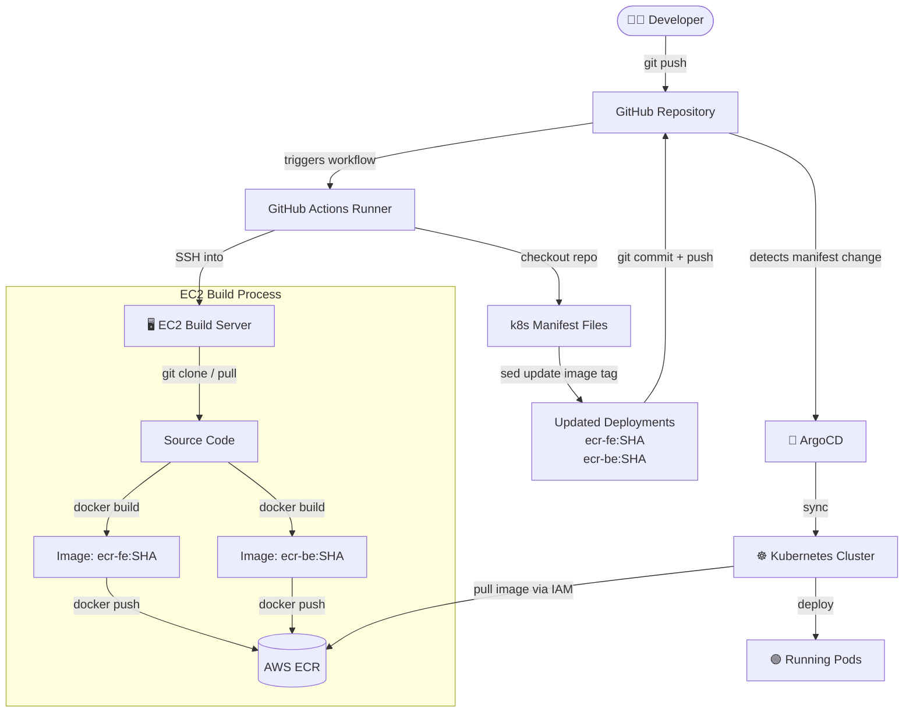
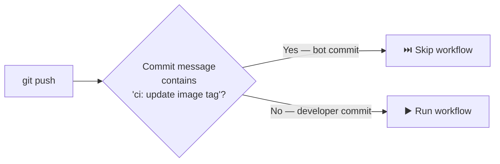

# ⚡ CI/CD Workflow: Build and Push on EC2

This document describes the GitHub Actions workflow that automates building Docker images on a dedicated EC2 instance, pushing them to Amazon ECR, and performing a GitOps-style manifest update for ArgoCD.

---

## 🏗 How It Works

### High-Level Architecture

### 🔁 Infinite Loop Prevention

Because the workflow commits back to the repository, it includes a safety mechanism to prevent infinite loops:

---

## 🔑 Required GitHub Secrets

Configure these in **Settings → Secrets and variables → Actions**:

| Secret Name | Description | How to get it |
|---|---|---|
| `EC2_SSH_PRIVATE_KEY` | Private key (`.pem`) to SSH into EC2 | AWS EC2 Key Pairs |
| `EC2_HOST` | Public IP or DNS of the EC2 instance | AWS EC2 Console |
| `EC2_HOST_KEY` | SSH host fingerprint of EC2 | Run `ssh-keyscan -H <EC2_IP>` |
| `GIT_USERNAME` | GitHub username for git auth on EC2 | Your GitHub username |
| `GIT_PASSWORD` | GitHub Personal Access Token (PAT) | GitHub → Developer settings → PAT |

> **Security Note:** `EC2_HOST_KEY` prevents Man-in-the-Middle (MitM) attacks by explicitly verifying the build server's identity instead of skipping host key checking.

---

## ⚙️ Setup Guide

### 1. EC2 Build Server Prerequisites

The target EC2 build server must have:
- `docker` installed and running.
- `aws-cli` installed.
- An **IAM Role** attached with `AmazonEC2ContainerRegistryPowerUser` (or equivalent permissions) to push to ECR without requiring long-lived AWS Access Keys.

### 2. GitHub Actions Permissions

To allow the workflow to update the Kubernetes manifests, navigate to **Settings → Actions → General → Workflow permissions** and select:
- ✅ **Read and write permissions**
- ✅ **Allow GitHub Actions to create and approve pull requests**

---

## 🌍 Environment Variables

These are defined inside `.github/workflows/deploy-ecr-on-ec2.yml`:

| Variable | Default Value | Description |
|---|---|---|
| `REPO_DIR` | `/home/ubuntu/cicd-ecr-kube-ec2-gitaction` | Workspace path on the EC2 runner |
| `REPO_URL` | GitHub HTTPS URL | Used by EC2 to clone/pull |
| `REGISTRY` | `<aws-account>.dkr.ecr.us-east-1.amazonaws.com` | Amazon ECR registry base URL |
| `AWS_REGION` | `us-east-1` | Target AWS region |
| `IMAGE_TAG` | `${{ github.sha }}` | Uses the commit SHA for immutable tags |
