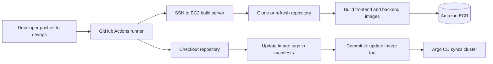

# GitHub Actions CI/CD


This folder contains the deployment workflow that builds the application images, pushes them to Amazon ECR, and updates Kubernetes manifests so Argo CD can deploy the new version.

The workflow is intentionally split between GitHub-hosted runners and a dedicated EC2 build server. GitHub Actions orchestrates the process, while Docker builds and ECR pushes run on EC2 where AWS access and Docker caching are available.

## Architecture



## Workflow

| File | Purpose |
|---|---|
| `deploy-ecr-on-ec2.yml` | Main CI/CD workflow for branch `devops`. |

## Trigger

The workflow runs on:

```yaml
on:
  push:
    branches:
      - devops
```

It skips commits whose message contains `ci: update image tag` to prevent an infinite loop after the workflow commits updated Kubernetes manifests.

## Images

| Application | Dockerfile | ECR image |
|---|---|---|
| Frontend | `hospital_FE/Dockerfile` | `606030503959.dkr.ecr.us-east-1.amazonaws.com/ecr-fe:<git-sha>` |
| Backend | `hospital_BE/Hospital_API/Dockerfile` | `606030503959.dkr.ecr.us-east-1.amazonaws.com/ecr-be:<git-sha>` |

The tag is always `${{ github.sha }}`. This gives a direct link between a running image and the Git commit that produced it.

## Required GitHub Secrets

Configure these in repository settings:

| Secret | Purpose |
|---|---|
| `EC2_SSH_PRIVATE_KEY` | Private SSH key used by the GitHub runner to access the EC2 build host. |
| `EC2_HOST` | Public IP or DNS name of the EC2 build host. |
| `EC2_HOST_KEY` | Host key from `ssh-keyscan -H <EC2_HOST>`. |
| `GIT_USERNAME` | GitHub username used on the EC2 build host. |
| `GIT_PASSWORD` | GitHub personal access token used on the EC2 build host. |

## EC2 Build Server Requirements

The build server must have:

| Requirement | Notes |
|---|---|
| Docker | Must be installed and usable with `sudo docker`. |
| AWS CLI | Used for `aws ecr get-login-password`. |
| IAM permissions | Must be able to push to ECR repositories `ecr-fe` and `ecr-be`. |
| Git access | Must be able to clone and fetch this repository. |
| Disk space | Must be enough for Docker layers and build cache. |

## Deployment Steps

1. GitHub runner writes the SSH key and known host entry.
2. Runner SSHes into the EC2 build host.
3. EC2 host clones the repository if missing, otherwise fetches and resets to the pushed branch.
4. EC2 host logs in to ECR.
5. EC2 host builds frontend and backend images.
6. EC2 host tags and pushes both images to ECR.
7. GitHub runner checks out the repository.
8. Runner updates image tags in Kubernetes manifests.
9. Runner commits and pushes the manifest changes to `devops`.
10. Argo CD detects the Git change and syncs the cluster.

## Files Updated by CI

```text
k8s-traefik-lb-demo/k8s/05-fe-deployment.yaml
k8s-traefik-lb-demo/k8s/07-be-deployment.yaml
```

## Verification

Check the GitHub Actions run log first. Then confirm the image tags in Git and in Kubernetes:

```bash
git log --oneline -5
grep -R "image: .*ecr-" k8s-traefik-lb-demo/k8s/*-deployment.yaml
kubectl -n hospital get deploy fe-deployment-v1 be-deployment-v1 -o wide
kubectl -n hospital describe deploy fe-deployment-v1
kubectl -n hospital describe deploy be-deployment-v1
```

## Troubleshooting

| Symptom | Check |
|---|---|
| SSH fails | `EC2_SSH_PRIVATE_KEY`, `EC2_HOST`, `EC2_HOST_KEY`, EC2 security group port 22. |
| Docker build fails | Dockerfile path, build context, EC2 disk space, dependency download access. |
| ECR push fails | AWS CLI login, EC2 IAM role, ECR repository names, region `us-east-1`. |
| Commit step fails | Workflow permission `contents: write`, protected branch rules, repository token permissions. |
| Argo CD does not deploy | Argo CD application source branch/path and sync status. |
