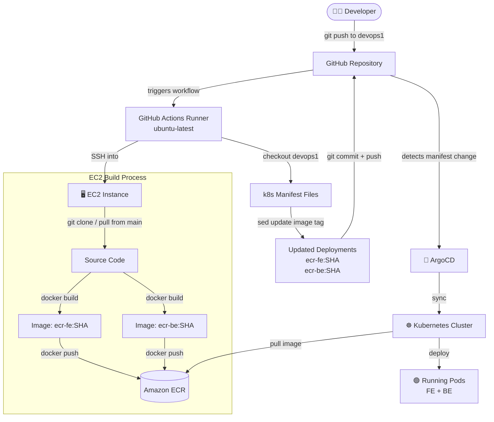
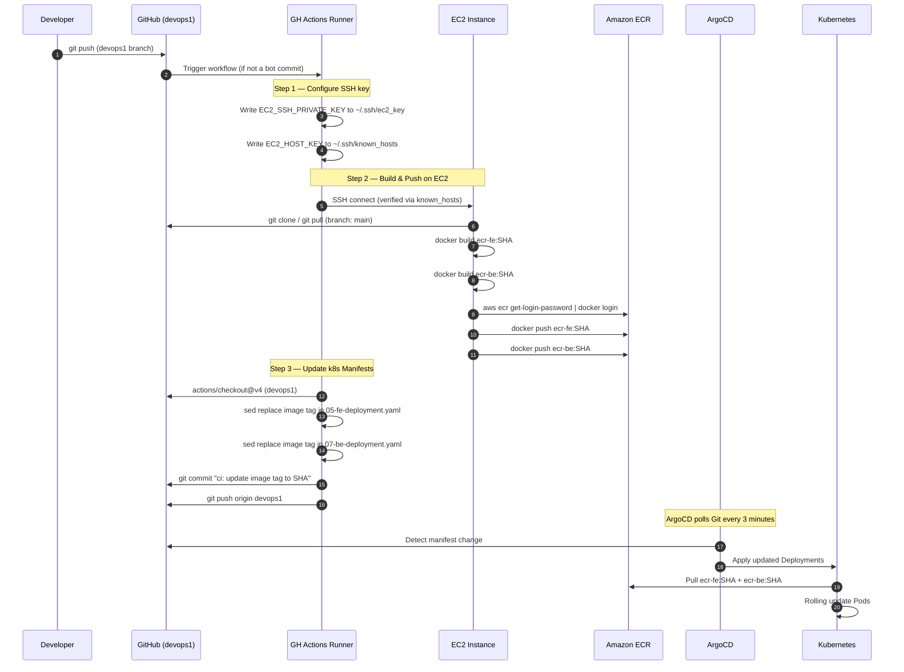
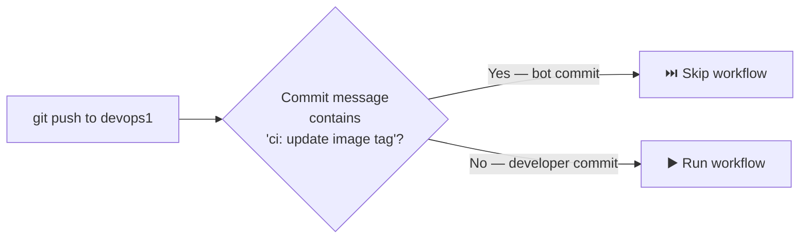

# CI/CD Workflow: Build and Push on EC2

This document describes the GitHub Actions workflow that automates building Docker images on an EC2 instance and pushing them to Amazon ECR, followed by a GitOps-style manifest update for ArgoCD.

---

## How It Works

### High-Level Flow



---

### Detailed Step-by-Step



---

### Infinite Loop Prevention



---

## Required GitHub Secrets

Go to **GitHub repo → Settings → Secrets and variables → Actions** and add the following:

| Secret Name | Description | How to get it |
|---|---|---|
| `EC2_SSH_PRIVATE_KEY` | Private key (`.pem`) to SSH into EC2 | From your AWS key pair |
| `EC2_HOST` | Public IP or DNS of the EC2 instance | AWS EC2 Console |
| `EC2_HOST_KEY` | SSH host fingerprint of EC2 | `ssh-keyscan -H <EC2_IP>` |
| `GIT_USERNAME` | GitHub username for git auth on EC2 | Your GitHub username |
| `GIT_PASSWORD` | GitHub Personal Access Token (PAT) | GitHub → Settings → Developer settings → PAT |

---

## Setup Guide

### 1. EC2 Prerequisites

Ensure the EC2 instance has these tools installed:

```bash
# AWS CLI
aws --version

# Docker
docker --version

# Verify IAM role allows ECR push
aws ecr get-login-password --region us-east-1
```

The EC2 instance must have an **IAM Role** attached with the `AmazonEC2ContainerRegistryPowerUser` policy (or equivalent ECR push permissions).

---

### 2. Get EC2 Host Key (for SSH security)

Run this from your local machine to get the EC2 SSH fingerprint:

```bash
ssh-keyscan -H <EC2_PUBLIC_IP> 2>/dev/null
```

Copy the full output (3 lines) and save it as the `EC2_HOST_KEY` secret.

> **Why?** This replaces `StrictHostKeyChecking=no` and prevents Man-in-the-Middle attacks.
> If you recreate the EC2 instance, you must update this secret.

---

### 3. GitHub Actions Permissions

Go to **GitHub repo → Settings → Actions → General → Workflow permissions** and select:

- ✅ **Read and write permissions**
- ✅ **Allow GitHub Actions to create and approve pull requests**

This allows the workflow to commit the updated manifest back to the repository.

---

### 4. ArgoCD Application

Apply the ArgoCD Application manifest to your cluster:

```bash
kubectl apply -f argocd/hospital-traefik-app.yaml
```

ArgoCD will watch the `k8s-traefik-lb-demo/k8s/` path on the `devops1` branch and automatically sync whenever the workflow commits a new image tag.

---

## Environment Variables (defined in workflow)

| Variable | Value | Description |
|---|---|---|
| `REPO_DIR` | `/home/ubuntu/cicd-ecr-kube-ec2-gitaction` | Repo path on EC2 |
| `REPO_URL` | GitHub HTTPS URL | Cloned/pulled on EC2 |
| `REGISTRY` | `606030503959.dkr.ecr.us-east-1.amazonaws.com` | ECR registry base URL |
| `AWS_REGION` | `us-east-1` | AWS region for ECR |
| `IMAGE_TAG` | `github.sha` | Commit SHA, unique per push |

---

## Trigger Condition

The workflow runs on every push to the `devops1` branch, **except** commits made by the CI bot itself (identified by the message prefix `ci: update image tag`). This prevents an infinite loop where updating the manifest would re-trigger the build.
