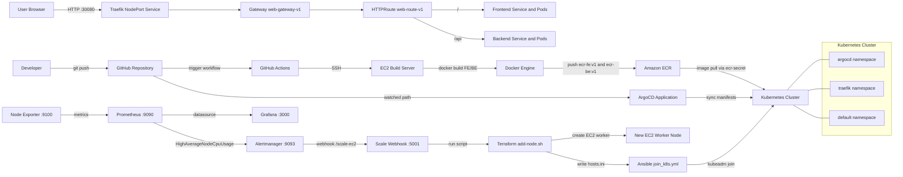

# Hospital App CI/CD and GitOps Deployment

This repository contains a full deployment workflow for a hospital web application using Docker, Amazon ECR, Kubernetes, Traefik Gateway API, ArgoCD GitOps, Prometheus, Grafana, Alertmanager, Terraform, and Ansible.

The project has two main application components:

- `hospital_FE`: frontend web application.
- `hopital_BE/Hospital_API`: backend API application.

The deployment model is split into these responsibilities:

- GitHub Actions builds Docker images and pushes them to Amazon ECR.
- ArgoCD watches Kubernetes manifests in Git and syncs them into the cluster.
- Prometheus, Grafana, and Alertmanager monitor the system and trigger scale-out automation.
- Terraform creates new EC2 worker nodes, then Ansible joins them to the Kubernetes cluster.

## Architecture Overview



## Deployment Flow

```text
Developer pushes code
        |
        v
GitHub Actions connects to EC2 through SSH
        |
        v
EC2 pulls the repository, builds FE and BE Docker images
        |
        v
Images are tagged as v1 and pushed to Amazon ECR
        |
        v
ArgoCD watches k8s-traefik-lb-demo/k8s in GitHub
        |
        v
ArgoCD syncs Kubernetes manifests into the cluster
        |
        v
Kubernetes pulls images from ECR and runs the application
        |
        v
Traefik Gateway routes traffic to FE and BE services
```

Auto-scale flow:

```text
Node Exporter exposes host metrics
        |
        v
Prometheus scrapes metrics and evaluates alert_rules.yml
        |
        v
HighAverageNodeCpuUsage fires when average CPU is above threshold
        |
        v
Alertmanager routes the alert to the scale webhook
        |
        v
Scale webhook runs the Terraform + Ansible provisioning flow
        |
        v
Terraform creates one more EC2 worker node
        |
        v
Ansible prepares the node and joins it to the Kubernetes cluster
```

Grafana reads Prometheus as a datasource for dashboards, while Alertmanager handles the alert-to-scale path.

## Repository Structure

```text
.github/workflows/
  deploy-ecr-on-ec2.yml        GitHub Actions workflow for building and pushing images

argocd/
  README.md                    ArgoCD model and GitOps notes
  SETUP.md                     ArgoCD setup guide
  hospital-traefik-app.yaml    ArgoCD Application manifest

k8s-traefik-lb-demo/k8s/
  00-namespace.yaml            Traefik namespace
  01-traefik-rbac.yaml         Traefik RBAC
  02-traefik-gatewayclass.yaml GatewayClass
  03-traefik-deployment.yaml   Traefik controller
  04-traefik-service.yaml      Traefik NodePort service
  05-fe-deployment.yaml        Frontend deployment
  06-fe-service.yaml           Frontend service
  07-be-deployment.yaml        Backend deployment
  08-be-service.yaml           Backend service
  09-gateway-routes.yaml       Gateway, HTTPRoute, and Middleware

hospital_FE/                   Frontend source
hopital_BE/Hospital_API/       Backend API source
terraform/                     EC2 worker node provisioning
ansible-web/                   Worker node bootstrap and kubeadm join
prometheus/                    Monitoring config
alertmanager/                  Alerting config
```

## CI: Build and Push Images

Workflow file:

```text
.github/workflows/deploy-ecr-on-ec2.yml
```

The workflow runs on push to the configured branch and performs these steps:

1. Configures an SSH key from GitHub Secrets.
2. Connects to the EC2 build server.
3. Clones or updates this repository on EC2.
4. Logs in to Amazon ECR.
5. Builds frontend and backend images.
6. Pushes both images with tag `v1`.

Images pushed:

```text
<ECR_REGISTRY>/ecr-fe:v1
<ECR_REGISTRY>/ecr-be:v1
```

Required GitHub Secrets:

```text
EC2_SSH_PRIVATE_KEY
EC2_HOST
GIT_USERNAME
GIT_PASSWORD
ECR_REGISTRY
```

## CD: ArgoCD GitOps

ArgoCD Application manifest:

```text
argocd/hospital-traefik-app.yaml
```

ArgoCD watches this repository path:

```text
k8s-traefik-lb-demo/k8s
```

Application settings:

```text
Application name: hospital-traefik-app
Project: default
Destination cluster: https://kubernetes.default.svc
Destination namespace: default
Sync policy: automated, prune, selfHeal
```

Git is the source of truth. If a Kubernetes resource is changed manually, ArgoCD can restore it from Git. If a manifest is removed from Git, ArgoCD can prune the live resource.

## Kubernetes Runtime Model

Namespaces:

```text
argocd    ArgoCD components
traefik   Traefik Gateway controller and NodePort service
default   Hospital frontend/backend app and Gateway resources
```

Main traffic path:

```text
User
  -> Traefik NodePort :30080
  -> Gateway web-gateway-v1
  -> HTTPRoute web-route-v1
  -> /api -> be-service-v1 -> backend pods
  -> /    -> fe-service-v1 -> frontend pods
```

The frontend and backend deployments use ECR images:

```text
<aws-account-id>.dkr.ecr.<aws-region>.amazonaws.com/ecr-fe:v1
<aws-account-id>.dkr.ecr.<aws-region>.amazonaws.com/ecr-be:v1
```

Because the images are private, Kubernetes needs this image pull secret in the `default` namespace:

```text
ecr-secret
```

## Monitoring, Grafana, and Auto Scaling

Prometheus configuration:

```text
prometheus/prometheus.yml
prometheus/alert_rules.yml
```

Alertmanager configuration:

```text
alertmanager/alertmanager.yml
```

Scale webhook:

```text
alertmanager/scale_webhook.py
alertmanager/scale-webhook.service
alertmanager/scale-webhook.env.example
```

The monitoring stack uses this flow:

```text
Node Exporter
  -> Prometheus
       -> Grafana dashboard
       -> Alertmanager
            -> Scale Webhook
                 -> Terraform
                 -> Ansible
                 -> New Kubernetes Worker Node
```

The current alert rule is:

```text
HighAverageNodeCpuUsage
```

It fires when average node CPU usage is above the configured threshold for the configured duration. The alert includes:

```text
action=scale-ec2
```

Alertmanager routes that alert to:

```text
http://<scale-webhook-host>:5001/scale-ec2
```

The webhook has cooldown and lock handling so repeated alerts do not start multiple scale operations at the same time.

Grafana is the visualization layer. It should use Prometheus as a datasource:

```text
http://<prometheus-host>:9090
```

## Terraform and Ansible Scale-Out

Terraform creates EC2 worker nodes and writes the Ansible inventory:

```text
terraform/terraform.tfvars
terraform/add-node.sh
terraform/remove-node.sh
ansible-web/hosts.ini
```

Ansible prepares the new EC2 worker and joins it to Kubernetes:

```text
ansible-web/join_k8s.yml
ansible-web/common.sh
ansible-web/.env
```

The combined scale-out script is:

```text
ansible-web/provision-ec2-and-run-ansible.sh
```

Manual scale-out:

```bash
bash ansible-web/provision-ec2-and-run-ansible.sh
```

Verify nodes:

```bash
kubectl get nodes -o wide
```

## Server Setup Summary

Run these commands on the Kubernetes control server.

Install ArgoCD:

```bash
kubectl create namespace argocd
kubectl apply -n argocd -f https://raw.githubusercontent.com/argoproj/argo-cd/stable/manifests/install.yaml
```

Expose ArgoCD UI temporarily:

```bash
kubectl port-forward svc/argocd-server -n argocd 8080:443 --address 0.0.0.0
```

Open:

```text
https://<server-public-ip>:8080
```

Create the ECR pull secret:

```bash
kubectl delete secret ecr-secret -n default --ignore-not-found
ECR_PASSWORD=$(aws ecr get-login-password --region ap-southeast-1)
kubectl create secret docker-registry ecr-secret \
  --docker-server=<aws-account-id>.dkr.ecr.<aws-region>.amazonaws.com \
  --docker-username=AWS \
  --docker-password="$ECR_PASSWORD" \
  -n default
```

Apply the ArgoCD Application:

```bash
kubectl apply -f argocd/hospital-traefik-app.yaml
```

More detailed steps are in:

```text
argocd/SETUP.md
```

## Access URLs

ArgoCD UI with port-forward:

```text
https://<server-public-ip>:8080
```

Hospital app through Traefik:

```text
http://<server-public-ip>:30080
```

Direct frontend test with port-forward:

```bash
kubectl port-forward svc/fe-service-v1 8081:80 --address 0.0.0.0
```

Then open:

```text
http://<server-public-ip>:8081
```

Prometheus:

```text
http://<server-public-ip>:9090
```

Alertmanager:

```text
http://<server-public-ip>:9093
```

Grafana:

```text
http://<server-public-ip>:3000
```

Scale webhook endpoint:

```text
http://<server-private-ip-or-internal-host>:5001/scale-ec2
```

## Verification Commands

Check app pods:

```bash
kubectl get pods -n default
```

Check Traefik:

```bash
kubectl get pods -n traefik
kubectl get svc -n traefik
```

Check Gateway resources:

```bash
kubectl get gateway,httproute -n default
```

Check ArgoCD Application:

```bash
kubectl get application hospital-traefik-app -n argocd
```

Check worker nodes:

```bash
kubectl get nodes -o wide
```

Check Prometheus targets and alerts:

```text
http://<server-public-ip>:9090/targets
http://<server-public-ip>:9090/alerts
```

Check Alertmanager:

```text
http://<server-public-ip>:9093
```

Check Grafana:

```text
http://<server-public-ip>:3000
```

Check scale webhook service:

```bash
systemctl status scale-webhook
journalctl -u scale-webhook -f
```

## Notes

- Use Git commits for long-term deployment changes.
- Manual changes with `kubectl` are temporary when ArgoCD `selfHeal` is enabled.
- The Traefik service exposes HTTP on NodePort `30080` and HTTPS on NodePort `30443`.
- The current image tag convention is `v1` for both frontend and backend.
- Prometheus and Alertmanager are configured as Docker-based services in this repository.
- Grafana is used as the dashboard layer with Prometheus as its datasource.
- Auto scale-out adds EC2 worker nodes; application replica count is still controlled by Kubernetes manifests.
