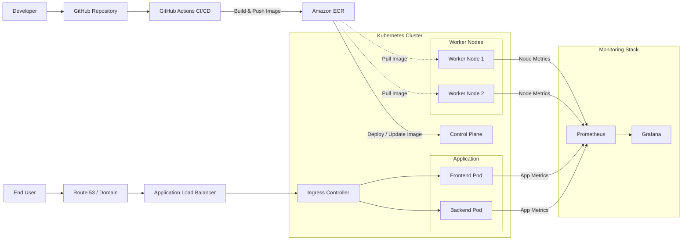

## Architecture Overview

### Description

- Source code is pushed to GitHub
- GitHub Actions builds Docker images and pushes them to Amazon ECR
- Kubernetes pulls images from ECR and deploys the application
- Users access the system through Route 53 and an Application Load Balancer
- Prometheus collects infrastructure and application metrics
- Grafana visualizes monitoring dashboards
