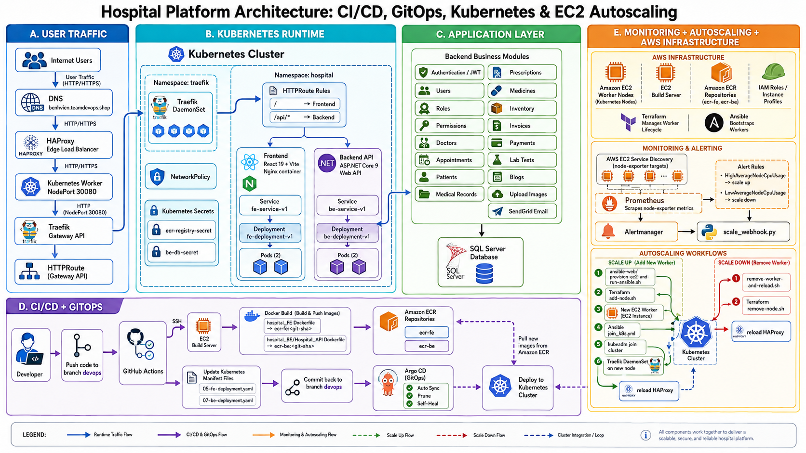
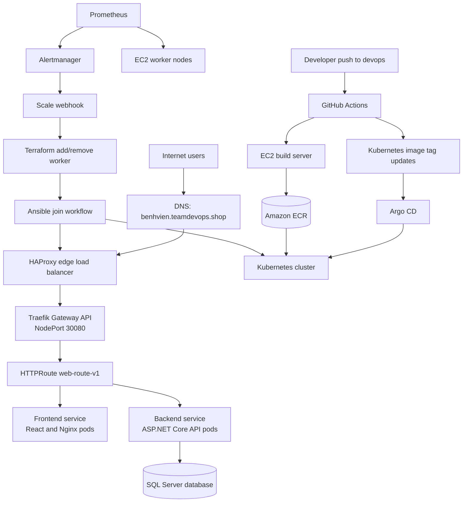
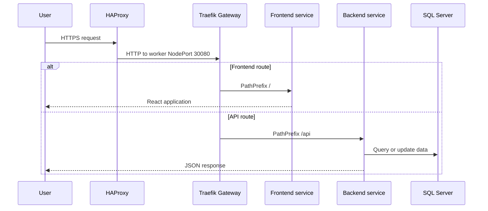
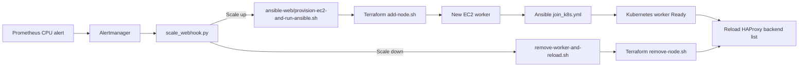

# Hospital Platform: CI/CD, GitOps, Kubernetes, and EC2 Autoscaling


This repository contains an end-to-end deployment platform for a Hospital web application. It covers application source code, container builds, Amazon ECR image publishing, Kubernetes runtime manifests, Traefik Gateway routing, HAProxy public load balancing, GitOps with Argo CD, Prometheus monitoring, Alertmanager-driven scaling, Terraform EC2 workers, and Ansible node bootstrap automation.

The project is designed as a practical DevOps reference architecture: application changes are built by GitHub Actions, deployed by Argo CD, exposed through a hardened edge path, monitored by Prometheus, and scaled through infrastructure automation.

## System Architecture





## Runtime Traffic Flow



Public endpoint:

```text
https://benhvien.teamdevops.shop
```

Important public API checks:

```bash
curl -i https://benhvien.teamdevops.shop/api/User/test
curl -i https://benhvien.teamdevops.shop/api/Branch
```

Backend-only endpoints such as `/healthz` and `/swagger` are available when you access the backend service directly, for example with `kubectl port-forward svc/be-service-v1`.

## Repository Map

| Path | Responsibility |
|---|---|
| `hospital_FE/` | React 19 and Vite frontend, packaged into an Nginx container. |
| `hospital_BE/Hospital_API/` | ASP.NET Core 9 Web API, Entity Framework Core, JWT authentication, SQL Server integration, Swagger. |
| `.github/workflows/` | CI pipeline that builds images on an EC2 build server, pushes to ECR, and updates Kubernetes manifests. |
| `argocd/` | Argo CD `Application` for GitOps deployment from this repository. |
| `k8s-traefik-lb-demo/k8s/` | Kubernetes namespaces, Traefik Gateway API, deployments, services, routes, middleware, and network policies. |
| `k8s-traefik-lb-demo/alb/` | HAProxy edge load balancer, TLS setup, node discovery, and graceful reload scripts. |
| `prometheus/` | Prometheus scrape configuration and autoscaling alert rules. |
| `alertmanager/` | Alertmanager routing plus a Python webhook that runs scale actions. |
| `terraform/` | AWS EC2 worker node provisioning and inventory generation. |
| `ansible-web/` | Worker bootstrap and Kubernetes join automation. |
| `scripts/` | Manual helper scripts for one-off image and ECS operations. |

## Deployment Lifecycle

```mermaid
flowchart LR
    A[Code push to devops] --> B[GitHub Actions starts]
    B --> C[SSH to EC2 build server]
    C --> D[Build FE and BE Docker images]
    D --> E[Push images to Amazon ECR]
    E --> F[Update image tags in k8s manifests]
    F --> G[Commit changes back to devops]
    G --> H[Argo CD detects drift]
    H --> I[Argo CD syncs Kubernetes]
    I --> J[Traefik routes production traffic]
```



The image tag is the Git commit SHA. The CI job updates:

```text
k8s-traefik-lb-demo/k8s/05-fe-deployment.yaml
k8s-traefik-lb-demo/k8s/07-be-deployment.yaml
```

## Infrastructure Lifecycle



## Prerequisites

Install or prepare the following before operating the full platform:

| Area | Requirement |
|---|---|
| Local tools | `git`, `docker`, `kubectl`, `terraform`, `ansible`, `aws`, `bash`, `python3`, `dotnet`, `node`, `npm`. |
| AWS | VPC, security groups, EC2 key pair, ECR repositories `ecr-fe` and `ecr-be`, IAM permission for EC2 and ECR. |
| Kubernetes | A working control plane, worker node network access, Gateway API CRDs, Traefik CRDs. |
| DNS/TLS | DNS record for `benhvien.teamdevops.shop`, public HAProxy server, TLS certificate for HAProxy. |
| Secrets | GitHub Actions secrets, ECR pull secret, backend database secret, local `.env` files. |

## Initial Setup

1. Clone the repository:

```bash
git clone https://github.com/kien-devops/cicd-ecr-kube-ec2-gitaction.git
cd cicd-ecr-kube-ec2-gitaction
```

2. Configure Terraform:

```bash
cd terraform
cp terraform.tfvars.example terraform.tfvars
terraform init
terraform validate
terraform plan
```

3. Configure Ansible worker join automation:

```bash
cd ../ansible-web
cp .env.example .env
kubeadm token create --print-join-command
```

Put the generated `kubeadm join ...` command into `ansible-web/.env` as `KUBEADM_JOIN_COMMAND`.

4. Set up AWS Secrets Manager and External Secrets Operator (ESO):

Instead of creating secrets manually (which requires manual rotation of the ECR token every 12 hours), the system now uses **External Secrets Operator (ESO)** to automatically fetch the database connection string from AWS Secrets Manager and auto-rotate the ECR login token every hour.

a. Create a secret named `hospital-db-connection` in AWS Secrets Manager (`us-east-1`) with a key named `default-connection` containing your database connection string:
```text
Key: default-connection
Value: Server=<DB_HOST>,1433;Database=hospital;User Id=sa;Password=<DB_PASSWORD>;TrustServerCertificate=True;Encrypt=True
```

b. Apply the Argo CD application for External Secrets Operator:
```bash
kubectl apply -f argocd/external-secrets-app.yaml
```

Once the operator is running, it will automatically populate `ecr-registry-secret` and `be-db-secret` in the `hospital` namespace.

5. Apply the Kubernetes stack manually or let Argo CD manage it:

```bash
cd ../k8s-traefik-lb-demo
bash k8s/apply.sh
```

6. Configure HAProxy edge load balancing:

```bash
cd alb
cp .env.example .env
bash discover-traefik-nodes.sh
sudo docker compose up -d --force-recreate
```

7. Apply the Argo CD application:

```bash
kubectl apply -f ../../argocd/hospital-traefik-app.yaml
```

## Verification

Cluster:

```bash
kubectl get nodes -o wide
kubectl get pods -n traefik -o wide
kubectl get pods -n hospital -o wide
kubectl get gateway,httproute -n hospital
kubectl get svc -n traefik
```

Application:

```bash
curl -I https://benhvien.teamdevops.shop
curl -i https://benhvien.teamdevops.shop/api/User/test
curl -i https://benhvien.teamdevops.shop/api/Branch
```

Backend logs:

```bash
kubectl -n hospital logs deployment/be-deployment-v1 -c be-v1 --tail=100
```

GitOps:

```bash
kubectl -n argocd get applications
kubectl -n argocd describe application hospital-traefik-app
```

## Security and Secrets

Never commit real credentials. The repository is configured to ignore local environment files, Terraform state, private keys, local appsettings, and generated secrets.

Sensitive values should be injected through:

| Secret | Location |
|---|---|
| Database connection string | Kubernetes Secret `be-db-secret`. |
| ECR registry credentials | Kubernetes Secret `ecr-registry-secret`. |
| EC2 SSH private key | GitHub secret `EC2_SSH_PRIVATE_KEY` or local ignored key file. |
| GitHub token for EC2 build server | GitHub secret `GIT_PASSWORD`. |
| JWT and SendGrid settings | Local ignored `appsettings.json` or environment variables. |

## Troubleshooting Guide

| Symptom | First checks |
|---|---|
| `https://benhvien.teamdevops.shop` is unreachable | DNS record, HAProxy container, security group ports 80 and 443, TLS PEM file. |
| Frontend loads but API fails | `kubectl get httproute -n hospital`, backend pod status, backend service endpoints. |
| `/api/User/test` works but `/api/Branch` returns `500` | SQL Server connection string, database reachability, backend logs. |
| Pods cannot pull images | `ecr-registry-secret`, ECR image tag, worker IAM/network access. |
| Argo CD reverts manual changes | Expected behavior because `selfHeal` is enabled. Commit desired changes to Git. |
| HAProxy misses a new worker | Run `k8s-traefik-lb-demo/alb/reload-haproxy.sh` and check Traefik pods on that node. |
| Autoscaling does nothing | Prometheus alert state, Alertmanager route, webhook logs, cooldown files, Terraform credentials. |

## Folder Documentation

Each major component has its own operational README:

| Folder | README |
|---|---|
| CI/CD | `.github/workflows/README.md` |
| Frontend | `hospital_FE/README.md` |
| Backend solution | `hospital_BE/README.md` |
| Backend API | `hospital_BE/Hospital_API/README.md` |
| GitOps | `argocd/README.md` |
| Kubernetes runtime | `k8s-traefik-lb-demo/k8s/README.md` |
| HAProxy edge LB | `k8s-traefik-lb-demo/alb/README.md` |
| Monitoring | `prometheus/README.md` |
| Alerting and autoscaling webhook | `alertmanager/README.md` |
| AWS infrastructure | `terraform/README.md` |
| Worker bootstrap | `ansible-web/README.md` |
| Manual utilities | `scripts/README.md` |
