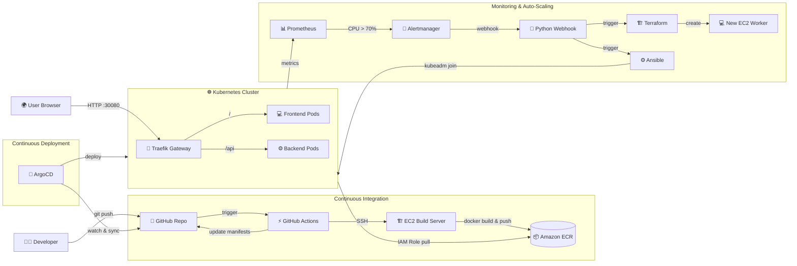

# 🏥 Hospital App CI/CD & GitOps Infrastructure

[](https://github.com/kien-devops/cicd-ecr-kube-ec2-gitaction/actions)
[](https://argoproj.github.io/cd/)
[](https://traefik.io/)
[](https://www.terraform.io/)
[](https://www.ansible.com/)
[](https://prometheus.io/)

A complete, production-ready DevOps implementation for a Hospital web application. This repository demonstrates a modern infrastructure stack featuring automated CI/CD, GitOps delivery, automated EC2 scaling, and robust monitoring.

---

## 📑 Table of Contents

1. [System Architecture](#-system-architecture)
2. [Deployment Workflow (CI/CD)](#-deployment-workflow-cicd)
3. [Auto-Scaling Automation](#-auto-scaling-automation)
4. [Project Structure](#-project-structure)
5. [Security & Authentication](#-security--authentication)
6. [Quick Start & Setup](#-quick-start--setup)
7. [Endpoints & Access](#-endpoints--access)

---

## 🏗 System Architecture

The architecture is built on AWS EC2, Kubernetes, and fully automated via Terraform and Ansible.



---

## 🚀 Deployment Workflow (CI/CD)

The application relies on a dual-pipeline approach combining **Push-based CI** and **Pull-based CD (GitOps)**.

### 1. Continuous Integration (GitHub Actions)
Triggered on `git push` to the `devops` branch (`.github/workflows/deploy-ecr-on-ec2.yml`):
1. **GitHub Actions** SSHes into a dedicated EC2 build server.
2. The server pulls the source code and builds the Docker images for `hospital_FE` and `hospital_BE`.
3. Images are tagged with the Git commit SHA (`${{ github.sha }}`).
4. The server pushes the images to Amazon ECR.
5. Actions updates `05-fe-deployment.yaml` and `07-be-deployment.yaml` with the new tags and commits back to the repo.

### 2. Continuous Deployment (ArgoCD GitOps)
1. **ArgoCD** continuously monitors the `k8s-traefik-lb-demo/k8s` directory in GitHub.
2. When the CI pipeline pushes updated manifests, ArgoCD detects the diff.
3. ArgoCD automatically syncs (`prune: true`, `selfHeal: true`) the changes into the `hospital` namespace.
4. Kubernetes pulls the new images securely from ECR using **IAM Instance Profiles** attached to the worker nodes.

---

## 📈 Auto-Scaling Automation

We implemented a custom auto-scaling solution using Prometheus and Terraform, bypassing standard cloud provider ASGs to maintain granular control:

1. **Scraping**: Prometheus scrapes `node_exporter` metrics from all Kubernetes nodes.
2. **Alerting**: The `HighAverageNodeCpuUsage` rule fires when cluster CPU > 70% for 2 minutes (scale-up). `LowAverageNodeCpuUsage` fires when CPU < 30% for 5 minutes (scale-down). Thresholds differ to prevent flapping.
3. **Webhook**: Alertmanager forwards the alert to a custom Python Webhook (`scale_webhook.py`).
4. **Provisioning**: The webhook triggers `provision-ec2-and-run-ansible.sh`.
5. **Infrastructure**: Terraform provisions a new EC2 instance (`add-node.sh`).
6. **Configuration**: Ansible installs Docker/Kubelet and joins the node to the Kubernetes cluster (`join_k8s.yml`).

---

## 📂 Project Structure

```text
.
├── .github/workflows/          # CI Pipeline (deploy-ecr-on-ec2.yml)
├── alertmanager/               # Alert routing & Auto-scale Python Webhook
├── ansible-web/                # Ansible playbooks (kubeadm join, node bootstrap)
├── argocd/                     # ArgoCD GitOps application manifests & setup docs
├── hospital_BE/                # Backend API (.NET Core)
├── hospital_FE/                # Frontend Web App (React/Vite)
├── k8s-traefik-lb-demo/
│   ├── alb/                    # External HAProxy Load Balancer config
│   └── k8s/                    # Kubernetes manifests (Gateway API, Deployments, Services)
├── prometheus/                 # Prometheus server & alert rules (alert_rules.yml)
└── terraform/                  # Terraform modules for EC2 worker provisioning
```

---

## 🔒 Security & Authentication

### 1. Kubernetes Zero Trust & Pod Security
- **NetworkPolicies**: A default-deny ingress model enforces strict zero-trust networking. Traffic is explicitly allowed only via defined routes (Traefik → Frontend:8000, Traefik/Frontend → Backend:8080).
- **Non-root Containers**: All Docker images (`FE`, `BE`) are built using unprivileged users (`nginx` UID 101, `app` UID 1654). Frontend runs on port 8000 to bypass `<1024` privileged port restrictions.
- **Pod Security Context**: `readOnlyRootFilesystem`, `allowPrivilegeEscalation: false`, and `capabilities.drop: [ALL]` are enforced at the Pod/Container level to prevent container escape and host compromise.

### 2. Traffic Routing, TLS, and Gateways
- **Ingress**: Uses the modern Kubernetes **Gateway API** (`GatewayClass: traefik`).
- **HTTPS & TLS**: Both HAProxy (external) and Traefik (internal) are configured to force HTTP → HTTPS redirection. Traefik is set up with an ACME Let's Encrypt resolver.
- **Security Middlewares**: Traefik enforces API rate limiting, prefix stripping (`/api`), and injects security headers (`X-Frame-Options`, `X-XSS-Protection`, etc.).

### 3. Secure ECR Pulls (No Image Pull Secrets)
We do **not** use static Kubernetes Secrets (`imagePullSecrets`) for pulling from ECR, eliminating the risk of token expiry (12-hour limit).
Instead, Terraform assigns an **AWS IAM Instance Profile** to all worker nodes (`terraform/modules/ec2-workers/iam.tf`). This allows Kubelet/containerd to authenticate transparently via the EC2 metadata service.

### 4. Database Security
- SQL connections force in-transit encryption (`Encrypt=True`, `TrustServerCertificate=False`).

### 5. Repository Security
- `.gitignore` prevents committing sensitive credentials (`appsettings.json`, `.env`, `*.pem`).
- CI/CD uses GitHub Secrets (`EC2_SSH_PRIVATE_KEY`, `GIT_PASSWORD`) injected safely at runtime.

---

## 🛠 Quick Start & Setup

### 1. Terraform & Ansible (Worker Nodes)
To manually scale the cluster out by one node:
```bash
cd ansible-web
bash provision-ec2-and-run-ansible.sh
```

### 2. ArgoCD Setup
Run these on your K8s control plane:
```bash
kubectl create namespace argocd
kubectl apply -n argocd -f https://raw.githubusercontent.com/argoproj/argo-cd/stable/manifests/install.yaml

# Apply the root GitOps application
kubectl apply -f argocd/hospital-traefik-app.yaml
```

### 3. Check Cluster State
```bash
kubectl get nodes -o wide
kubectl get pods -n hospital
kubectl get gateway,httproute -n hospital
```

---

## 🌐 Endpoints & Access

Assuming your external Load Balancer (or Control Plane public IP) is `<server-public-ip>`:

| Component | URL / Command | Notes |
|-----------|--------------|-------|
| **Hospital Web App** | `http://<server-public-ip>:30080` | Routed via Traefik Gateway NodePort |
| **ArgoCD UI** | `kubectl port-forward svc/argocd-server -n argocd 8080:443` | Open `https://localhost:8080` |
| **Prometheus** | `http://<server-public-ip>:9090` | Metrics & Targets |
| **Alertmanager** | `http://<server-public-ip>:9093` | Alert status |
| **Grafana** | `http://<server-public-ip>:3000` | Dashboards (use Prometheus as DS) |
| **Scale Webhook** | `http://<webhook-host>:5001/scale-ec2` | Internal listener for Alertmanager |

---
*Maintained by the DevOps Team. For detailed setup guides, check `argocd/SETUP.md` and `terraform/README.md`.*
