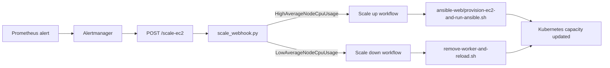

# Alertmanager and Scale Webhook


This folder contains Alertmanager configuration and a Python webhook that converts Prometheus alerts into infrastructure scale actions.

Alertmanager receives CPU alerts from Prometheus, routes them to the webhook endpoint, and the webhook decides whether to run scale-up or scale-down automation. The webhook includes cooldown and lock behavior so repeated alerts do not start overlapping scale operations.

## Architecture



## Files

| File | Purpose |
|---|---|
| `alertmanager.yml.tpl` | Template config using `${SCALE_WEBHOOK_URL}`. |
| `alertmanager.yml` | Rendered Alertmanager config. |
| `render-config.sh` | Renders `alertmanager.yml` from `.env`. |
| `scale_webhook.py` | HTTP webhook that receives Alertmanager JSON and runs scale scripts. |
| `.env.example` | Template for Alertmanager rendering. |
| `scale-webhook.env` | Optional local runtime env for the webhook. Ignored for secrets. |

## Alert Decision Logic

| Alert name | Required label | Action |
|---|---|---|
| `HighAverageNodeCpuUsage` | `action=scale-ec2` | Run scale up. |
| `LowAverageNodeCpuUsage` | `action=scale-down-ec2` | Run scale down. |

Only firing alerts are processed. Resolved alerts are ignored.

## Render Alertmanager Config

```bash
cd alertmanager
cp .env.example .env
```

Edit `.env`:

```env
SCALE_WEBHOOK_URL="http://<webhook-host>:5001/scale-ec2"
```

Render:

```bash
bash render-config.sh
```

## Run Alertmanager

```bash
docker network create demo_network || true

docker run -d \
  --name alertmanager \
  --network demo_network \
  -p 9093:9093 \
  -v "$(pwd):/etc/alertmanager:ro" \
  prom/alertmanager:latest
```

Open:

```text
http://<server-ip>:9093
```

## Run the Scale Webhook

Start locally:

```bash
cd alertmanager
python3 scale_webhook.py
```

By default the webhook binds to:

```text
127.0.0.1:5001
```

Useful variables:

| Variable | Default | Purpose |
|---|---|---|
| `SCALE_WEBHOOK_HOST` | `127.0.0.1` | Bind address. |
| `SCALE_WEBHOOK_PORT` | `5001` | Webhook port. |
| `SCALE_WEBHOOK_COOLDOWN_SECONDS` | `1800` | Cooldown between scale actions of the same type. |
| `SCALE_WEBHOOK_MIN_TERRAFORM_NODES` | `0` | Minimum Terraform worker count for scale down. |
| `SCALE_WEBHOOK_TIMEOUT_SECONDS` | `1800` | Timeout for the scale command. |
| `SCALE_WEBHOOK_STATE_DIR` | `alertmanager/` | Stores cooldown, lock, and log files. |
| `SCALE_SSH_TARGET` | empty | If set, run scale commands on a remote host over SSH. |

Example `scale-webhook.env`:

```env
SCALE_WEBHOOK_HOST=0.0.0.0
SCALE_WEBHOOK_PORT=5001
SCALE_WEBHOOK_COOLDOWN_SECONDS=1800
SCALE_WEBHOOK_MIN_TERRAFORM_NODES=1
SCALE_SSH_TARGET=ubuntu@<automation-host>
SCALE_SSH_KEY=/home/ubuntu/.ssh/kien.pem
SCALE_REPO_DIR=/home/ubuntu/cicd-ecr-kube-ec2-gitaction
```

## Scale Commands

When running locally:

| Action | Command |
|---|---|
| Scale up | `ansible-web/provision-ec2-and-run-ansible.sh` |
| Scale down | `remove-worker-and-reload.sh`, or fallback `terraform/remove-node.sh` |

When `SCALE_SSH_TARGET` is set, the webhook runs the configured remote command through SSH.

## Verification

Check rendered Alertmanager config:

```bash
docker run --rm \
  -v "$(pwd):/etc/alertmanager:ro" \
  prom/alertmanager:latest \
  --config.file=/etc/alertmanager/alertmanager.yml \
  --log.level=debug
```

Check webhook logs:

```bash
tail -f alertmanager/scale_webhook.log
```

Send a test scale-up alert:

```bash
curl -X POST http://127.0.0.1:5001/scale-ec2 \
  -H 'Content-Type: application/json' \
  -d '{"status":"firing","alerts":[{"status":"firing","labels":{"alertname":"HighAverageNodeCpuUsage","action":"scale-ec2"}}]}'
```

## Troubleshooting

| Symptom | Check |
|---|---|
| Alertmanager does not start | Rendered `alertmanager.yml`, YAML syntax, Docker volume path. |
| Webhook receives alerts but does nothing | Alert name, `action` label, alert status must be `firing`. |
| Repeated alerts are ignored | Cooldown files in `SCALE_WEBHOOK_STATE_DIR`. |
| Scale command overlaps | Lock file `.scale_ec2.lock`; remove only after confirming no scale process is running. |
| SSH scale command fails | `SCALE_SSH_TARGET`, key path, remote repo path, remote permissions. |
| Terraform fails from webhook | AWS credentials, `terraform.tfvars`, script permissions. |
