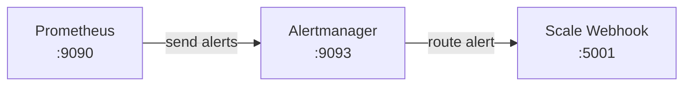

# Alertmanager

Run Alertmanager with the configuration from this folder.

Copy `.env.example` to `.env` and set the real scale webhook URL before rendering `alertmanager.yml`:

```bash
cp alertmanager/.env.example alertmanager/.env
bash alertmanager/render-config.sh
```

## Model



## Run With Docker

Create the Docker network if it does not already exist:

```bash
docker network create demo_network
```

Run Alertmanager:

```bash
docker run -d \
  --name alertmanager \
  --network demo_network \
  -p 9093:9093 \
  -v "<path-to-repo>/alertmanager:/etc/alertmanager:ro" \
  prom/alertmanager:latest
```

Replace `<path-to-repo>` with the absolute path to this repository on the server.

Open Alertmanager:

```text
http://<server-ip>:9093
```
