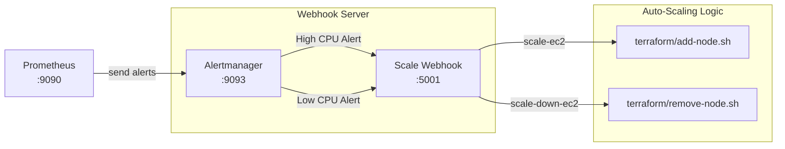

# 🔔 Alertmanager & Auto-Scaling Webhook


This directory contains the Alertmanager configuration and a custom Python webhook (`scale_webhook.py`) responsible for translating Prometheus alerts into infrastructure auto-scaling events.

---

## 🏗 Architecture Model



---

## ⚙️ Configuration Setup

Before running Alertmanager, you must render `alertmanager.yml` by providing the real webhook URL.

1. Copy the `.env.example`:
```bash
cp .env.example .env
```

2. Update `.env` with the URL of the server running the Python scale webhook:
```env
SCALE_WEBHOOK_URL="http://<WEBHOOK_SERVER_IP>:5001/scale-ec2"
```

3. Render the config:
```bash
bash render-config.sh
```

---

## 🐍 Scale Webhook Logic

The custom Python webhook `scale_webhook.py` handles requests dynamically based on the action label passed from Prometheus:

- **Scale-Out**: Alert `HighAverageNodeCpuUsage` passes `action=scale-ec2` -> Webhook runs `ansible-web/provision-ec2-and-run-ansible.sh` (Terraform ADD + Ansible Kubeadm Join).
- **Scale-In**: Alert `LowAverageNodeCpuUsage` passes `action=scale-down-ec2` -> Webhook runs `terraform/remove-node.sh` (Terraform DESTROY).

### 🛡️ Safety Mechanisms:
- **Locking**: Prevents multiple scale operations from running simultaneously.
- **Cooldown**: Enforces a time delay between consecutive scale-out or scale-in events to prevent thrashing.
- **Minimum Nodes**: Set `SCALE_WEBHOOK_MIN_TERRAFORM_NODES` in `scale-webhook.env` to prevent scaling in below a certain threshold.

---

## 🐳 Running Alertmanager via Docker

If not running via docker-compose, start it standalone:

```bash
docker network create demo_network || true

docker run -d \
  --name alertmanager \
  --network demo_network \
  -p 9093:9093 \
  -v "$(pwd):/etc/alertmanager:ro" \
  prom/alertmanager:latest
```

Access UI: `http://<server-ip>:9093`
