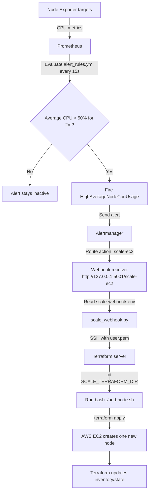

# Alertmanager EC2 Scale Webhook

Workflow:

1. Prometheus fires `HighAverageNodeCpuUsage` when average CPU across `node_exporter` targets is above 50%.
2. Alertmanager sends the alert to `http://127.0.0.1:5001/scale-ec2`.
3. `scale_webhook.py` receives the webhook and runs the scale command.
4. If `SCALE_SERVER_IP` is set, the webhook SSHs into that server and runs `cd $SCALE_TERRAFORM_DIR && bash ./add-node.sh`.
5. If no SSH target is configured, the webhook runs `terraform/add-node.sh` locally.



Example SSH mode:

```bash
cp alertmanager/scale-webhook.env.example alertmanager/scale-webhook.env
vi alertmanager/scale-webhook.env
python3 alertmanager/scale_webhook.py
```

`alertmanager/scale-webhook.env` is ignored by git. Put the Terraform server IP there:

```bash
SCALE_SERVER_IP=ip serrver 
SCALE_SSH_USER=ubuntu
SCALE_SSH_KEY=/home/ubuntu/alertmanager/user.pem
SCALE_TERRAFORM_DIR=/home/ubuntu/terraform
```

Install with systemd:

```bash
sudo cp alertmanager/scale-webhook.service /etc/systemd/system/
sudo systemctl daemon-reload
sudo systemctl enable --now scale-webhook
sudo systemctl status scale-webhook
```

Notes:

- The machine running the webhook must be able to SSH to the Terraform server without an interactive password prompt. The default key path is `alertmanager/user.pem`; on your server that is `/home/ubuntu/alertmanager/user.pem`.
- The Terraform server must already have AWS credentials, Terraform, and `terraform.tfvars` inside `SCALE_TERRAFORM_DIR`.
- Cooldown defaults to 30 minutes via `SCALE_WEBHOOK_COOLDOWN_SECONDS=1800`, so repeated alerts do not create EC2 instances continuously.
