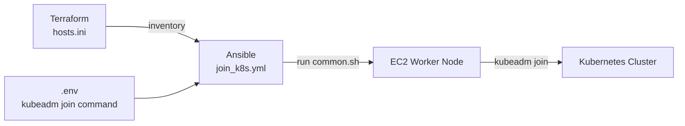

# Ansible

Run Ansible to prepare a new EC2 instance and join it as a Kubernetes worker node.

## Model



## Prepare Environment

Create the environment file:

```bash
cp ansible-web/.env.example ansible-web/.env
```

Edit `ansible-web/.env` and add the real `kubeadm join` command:

```bash
KUBEADM_JOIN_COMMAND=kubeadm join <CONTROL_PLANE_PRIVATE_IP>:6443 --token <TOKEN> --discovery-token-ca-cert-hash sha256:<CA_CERT_HASH>
```

If Terraform, Ansible, `kubectl`, Docker, and HAProxy all run on the same `servermonitor`, leave `ALB_RELOAD_TARGET` empty:

```bash
ALB_RELOAD_TARGET=
```

With this default setup, the full provision flow creates a worker, joins it to Kubernetes, then runs the local HAProxy reload on `servermonitor`.

Only set the remote reload target if HAProxy runs on another server:

```bash
ALB_RELOAD_TARGET=ubuntu@<HAPROXY_SERVER_PRIVATE_IP>
ALB_RELOAD_SSH_KEY=/home/ubuntu/cicd-ecr-kube-ec2-gitaction/ansible-web/kien.pem
ALB_RELOAD_SSH_PORT=22
ALB_RELOAD_DIR=/home/ubuntu/cicd-ecr-kube-ec2-gitaction/k8s-traefik-lb-demo/alb
```

Generate a new join command on the Kubernetes control plane if needed:

```bash
kubeadm token create --print-join-command
```

## Run Ansible

Make sure these files exist:

```text
ansible-web/.env
ansible-web/hosts.ini
ansible-web/kien.pem
```

Set SSH key permission:

```bash
chmod 400 ansible-web/kien.pem
```

Run the playbook:

```bash
cd ansible-web
ansible-playbook -i hosts.ini join_k8s.yml
```

## Run Full Provision Flow

From the repository root, create one EC2 node with Terraform and run Ansible automatically:

```bash
bash ansible-web/provision-ec2-and-run-ansible.sh
```

## Verify

Check the worker node from the Kubernetes control plane:

```bash
kubectl get nodes -o wide
```
