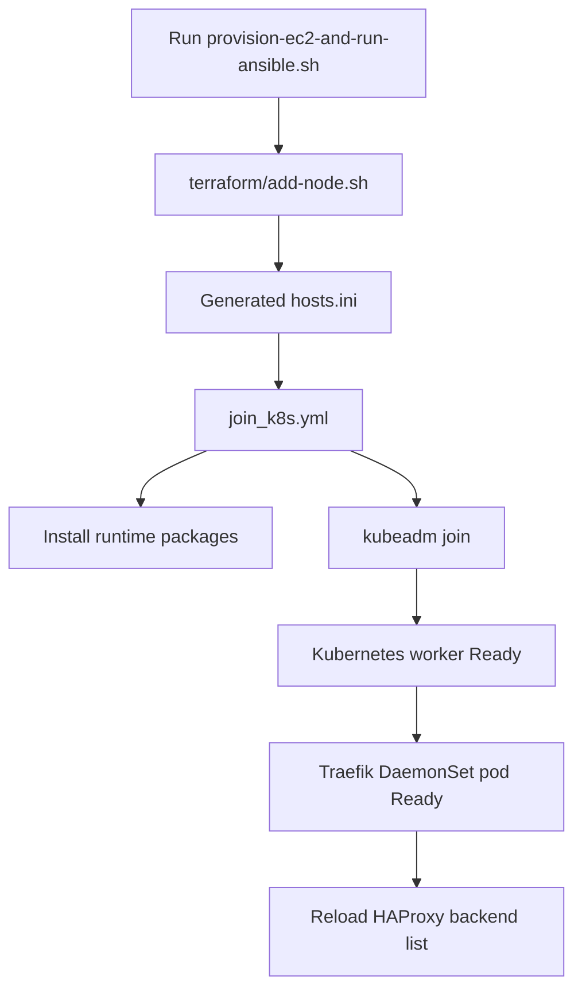

# Ansible Worker Bootstrap


This folder prepares new EC2 worker nodes and joins them to the Kubernetes cluster. It is the bridge between Terraform infrastructure creation and Kubernetes runtime capacity.

The main workflow creates a worker with Terraform, runs Ansible against the generated inventory, waits until Kubernetes sees the node as Ready, verifies that Traefik is running on the new node, and reloads HAProxy so public traffic can reach it.

## Architecture



## Files

| File | Purpose |
|---|---|
| `provision-ec2-and-run-ansible.sh` | Full scale-out workflow from EC2 creation to HAProxy reload. |
| `join_k8s.yml` | Ansible playbook that configures a worker and runs the Kubernetes join command. |
| `common.sh` | Shared shell helpers. |
| `.env.example` | Template for local runtime settings. |
| `hosts.ini` | Generated by Terraform. Do not edit manually. |
| `kien.pem` | Local EC2 SSH private key. Keep ignored and private. |

## Prerequisites

| Requirement | Notes |
|---|---|
| Terraform configured | `terraform/terraform.tfvars` must exist and work. |
| Ansible installed | Required to run `ansible-playbook`. |
| SSH key | Private key must match the AWS key pair used by Terraform. |
| Kubernetes control-plane access | `kubectl` must point at the target cluster. |
| Fresh join command | `kubeadm token create --print-join-command` from the control plane. |
| HAProxy reload access | Either local Docker access or remote reload variables in `.env`. |

## Environment Setup

Create the local env file:

```bash
cd ansible-web
cp .env.example .env
```

Generate a join command on the Kubernetes control plane:

```bash
kubeadm token create --print-join-command
```

Put it in `.env`:

```env
KUBEADM_JOIN_COMMAND="kubeadm join <control-plane-ip>:6443 --token <token> --discovery-token-ca-cert-hash sha256:<hash>"
```

Prepare the SSH key:

```bash
cp /path/to/private-key.pem kien.pem
chmod 400 kien.pem
```

If HAProxy is hosted on a different server, configure reload variables in `.env`:

```env
ALB_RELOAD_TARGET="ubuntu@<haproxy-host>"
ALB_RELOAD_SSH_KEY="/path/to/private-key.pem"
ALB_RELOAD_SSH_PORT="22"
ALB_RELOAD_DIR="/home/ubuntu/cicd-ecr-kube-ec2-gitaction/k8s-traefik-lb-demo/alb"
```

## Full Scale-Out Workflow

```bash
cd ansible-web
bash provision-ec2-and-run-ansible.sh
```

The script performs:

1. Validate required files: Terraform variables, add-node script, `.env`, SSH key.
2. Load ALB and Kubernetes environment variables.
3. Add one EC2 worker with `terraform/add-node.sh`.
4. Print Terraform outputs.
5. Run `ansible-playbook -i hosts.ini join_k8s.yml`.
6. Detect the newest Terraform private IP.
7. Wait for the matching Kubernetes node.
8. Wait for the node to become Ready.
9. Wait for a Ready Traefik pod on that node.
10. Reload HAProxy backend configuration.

## Run Only Ansible

Use this only when Terraform already created the EC2 instance and generated `hosts.ini`:

```bash
cd ansible-web
ansible-playbook -i hosts.ini join_k8s.yml
```

## Verification

```bash
kubectl get nodes -o wide
kubectl get pods -n traefik -o wide
kubectl rollout status daemonset/traefik -n traefik --timeout=300s
```

Verify HAProxy backends:

```bash
sudo docker exec haproxy-alb grep 'server worker' /usr/local/etc/haproxy/haproxy.cfg
```

## Troubleshooting

| Symptom | Check |
|---|---|
| Missing `hosts.ini` | `ansible_inventory_path` in `terraform/terraform.tfvars`. |
| SSH connection fails | Private key permissions, worker public IP, security group port 22. |
| Node does not join | Expired kubeadm token, control-plane port 6443, container runtime setup. |
| Node joins but is NotReady | CNI health, kubelet logs, node taints, runtime errors. |
| Traefik pod missing on new node | DaemonSet status, node labels, taints/tolerations. |
| HAProxy reload fails | Docker access, `kubectl` access, `.env` ALB reload settings. |
