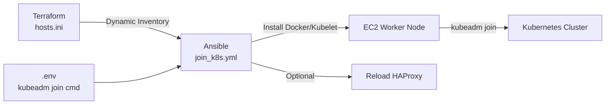

# ⚙️ Ansible Configuration Management


This directory contains the Ansible playbooks and scripts responsible for bootstrapping new EC2 instances and joining them to the Kubernetes cluster.

---

## 🏗 Architecture Model



---

## 🛠 Preparation

### 1. Environment Variables

Create the `.env` file from the example:
```bash
cp .env.example .env
```

Update it with your valid Kubernetes join command. You can generate a fresh token from your control plane:
```bash
kubeadm token create --print-join-command
```

Update `.env`:
```env
KUBEADM_JOIN_COMMAND="kubeadm join <CP_IP>:6443 --token <TOKEN> --discovery-token-ca-cert-hash sha256:<HASH>"
```

### 2. SSH Keys

Ensure your private key is present and strictly scoped:
```bash
chmod 400 kien.pem
```

---

## 🚀 Running Ansible

### Standalone Run
If Terraform has already generated `hosts.ini`, you can run the playbook directly:
```bash
ansible-playbook -i hosts.ini join_k8s.yml
```

### Full Provisioning Flow (Recommended)
To execute the complete auto-scaling flow (Terraform provisioning + Ansible configuration) in one shot:
```bash
bash provision-ec2-and-run-ansible.sh
```

---

## 🔄 HAProxy Reload Integration

If you are using HAProxy as an external Load Balancer (`k8s-traefik-lb-demo/alb`), Ansible can optionally trigger a graceful HAProxy reload after the new node joins the cluster. 

To enable this, configure the `ALB_RELOAD_*` variables inside `.env`. If running locally on the same management server, leave `ALB_RELOAD_TARGET` blank.
