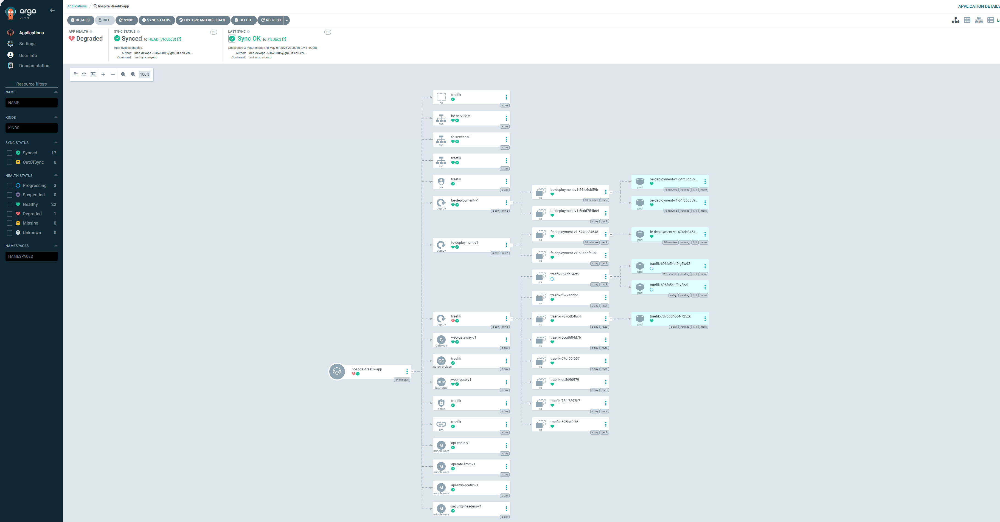

# ArgoCD GitOps Deployment

This folder documents the ArgoCD setup used to deploy the hospital application and Traefik Gateway stack from GitHub into the Kubernetes cluster.

## Model

```text
Developer
   |
   | git push
   v
GitHub Repository
https://github.com/kien-devops/cicd-ecr-kube-ec2-gitaction
   |
   | ArgoCD watches path
   v
ArgoCD Application
hospital-traefik-app
   |
   | sync
   v
Kubernetes Cluster
   |
   +-- namespace: argocd
   |     +-- ArgoCD server
   |     +-- repo server
   |     +-- application controller
   |
   +-- namespace: traefik
   |     +-- Traefik DaemonSet
   |     +-- Traefik Service NodePort 30080/30443
   |
   +-- namespace: hospital
         +-- Frontend Deployment/Service
         +-- Backend Deployment/Service
         +-- Gateway web-gateway-v1
         +-- HTTPRoute web-route-v1
         +-- Traefik Middleware resources
```

## Sync Flow

```text
Git manifest changes
        |
        v
ArgoCD detects OutOfSync
        |
        v
ArgoCD applies manifests from k8s-traefik-lb-demo/k8s
        |
        v
Kubernetes reconciles Deployments, Services, Gateway, and Routes
```

## Demo



## Application Source

- Repository: `https://github.com/kien-devops/cicd-ecr-kube-ec2-gitaction.git`
- Target revision: `HEAD`
- Manifest path: `k8s-traefik-lb-demo/k8s`
- Destination cluster: `https://kubernetes.default.svc`
- Destination namespace: `hospital`

## Files

- `hospital-traefik-app.yaml`: ArgoCD `Application` manifest for this project.
- `SETUP.md`: Server-side installation and setup commands.

## Runtime Access

ArgoCD UI through port-forward:

```bash
kubectl port-forward svc/argocd-server -n argocd 8080:443 --address 0.0.0.0
```

Open:

```text
https://<server-public-ip>:8080
```

Hospital app through Traefik NodePort:

```text
http://<server-public-ip>:30080
```
