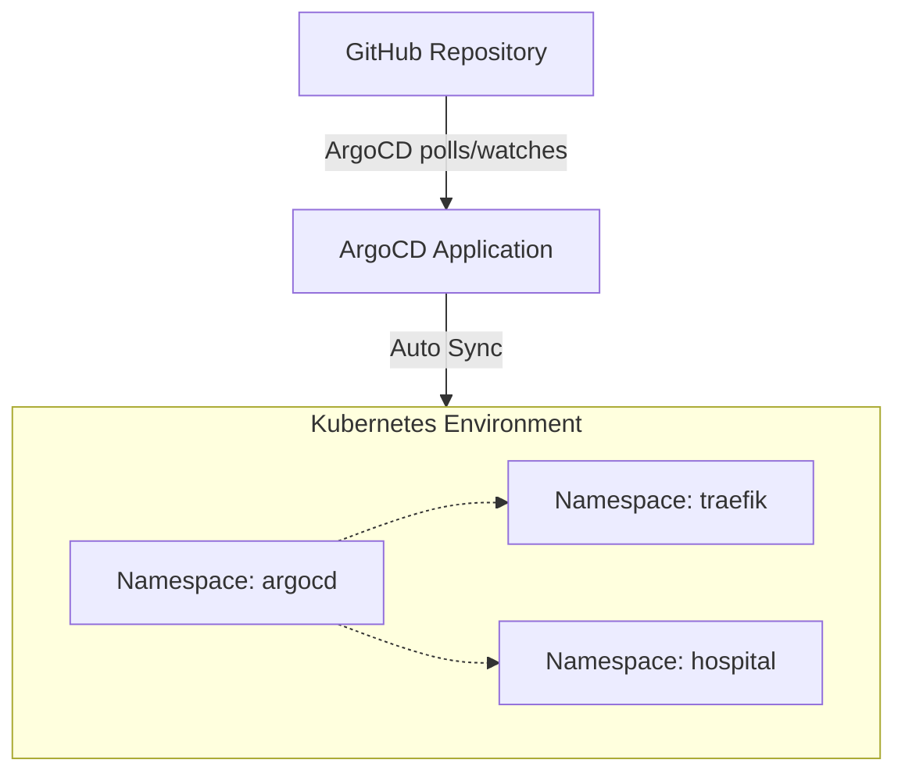

# 🐙 ArgoCD GitOps Deployment


This folder contains the ArgoCD application manifests and documentation for deploying the hospital web application and Traefik Gateway stack via GitOps.

---

## 🏗 Architecture Model



### 🔄 Sync Flow

1. **Commit:** GitHub Actions updates the image tag in the k8s manifests and pushes to the repository.
2. **Detect:** ArgoCD detects an `OutOfSync` state.
3. **Sync:** ArgoCD automatically applies the new manifests.
4. **Reconcile:** Kubernetes pulls the new ECR image (using IAM Instance Profiles) and performs a rolling update of the pods.

---

## 📂 Project Files

- `hospital-traefik-app.yaml`: The root ArgoCD `Application` Custom Resource Definition (CRD).
- `SETUP.md`: Step-by-step instructions for installing ArgoCD on a fresh cluster.

### Application Source Config

| Setting | Value |
|---|---|
| **Repository** | `https://github.com/kien-devops/cicd-ecr-kube-ec2-gitaction.git` |
| **Target Revision** | `devops` |
| **Path** | `k8s-traefik-lb-demo/k8s` |
| **Destination** | `https://kubernetes.default.svc` (in-cluster) |
| **Namespace** | `hospital` |
| **Auto-Sync** | Enabled (`prune: true`, `selfHeal: true`) |

---

## 🚀 Quick Access

To access the ArgoCD Dashboard locally, port-forward the service:

```bash
kubectl port-forward svc/argocd-server -n argocd 8080:443 --address 0.0.0.0
```
Then visit: `https://<server-ip>:8080` (Accept the self-signed certificate warning).

To retrieve the initial admin password:
```bash
kubectl -n argocd get secret argocd-initial-admin-secret -o jsonpath="{.data.password}" | base64 -d
