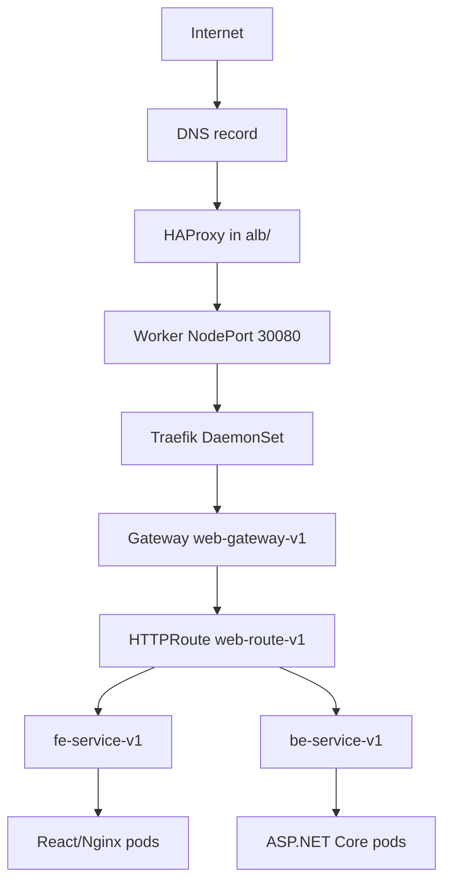

# Kubernetes Traefik Load Balancing Stack

This folder contains the Kubernetes runtime layer and the public HAProxy edge load balancer for the Hospital platform.

The stack separates public ingress from in-cluster routing:

| Layer | Responsibility |
|---|---|
| `alb/` | Public HAProxy endpoint, HTTPS termination, worker node discovery, backend reloads. |
| `k8s/` | Traefik Gateway API, application deployments, services, HTTP routes, middleware, network policies. |

## Architecture

## Public Endpoints

| Endpoint | Destination |
|---|---|
| `https://benhvien.teamdevops.shop/` | Frontend application. |
| `https://benhvien.teamdevops.shop/api/*` | Backend API. |
| `https://benhvien.teamdevops.shop/swagger` | Backend Swagger UI. |

## Deployment Order

1. Prepare Kubernetes cluster and worker nodes.
2. Create runtime secrets in namespace `hospital`.
3. Apply `k8s/` manifests manually or through Argo CD.
4. Configure DNS and TLS for HAProxy.
5. Start HAProxy from `alb/`.
6. Verify external traffic.

## Read Next

| Folder | Documentation |
|---|---|
| `k8s/` | Kubernetes manifests, Gateway API, services, secrets, network policies. |
| `alb/` | HAProxy edge load balancer, TLS certificate setup, node discovery, reload automation. |
