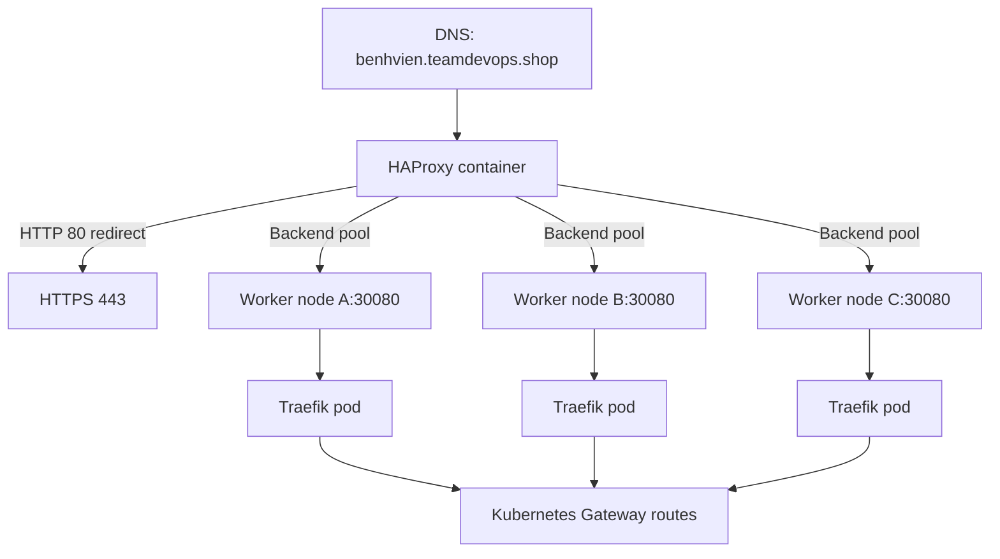
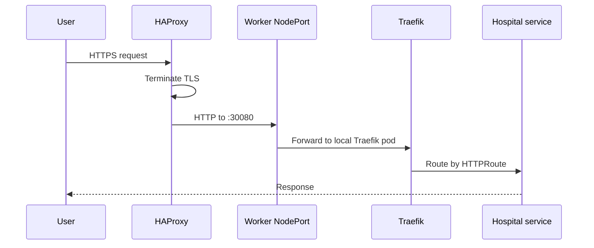

# HAProxy Edge Load Balancer


This folder runs the public load balancer in front of the Kubernetes cluster. HAProxy receives public traffic for `benhvien.teamdevops.shop`, redirects HTTP to HTTPS, terminates TLS, and forwards plain HTTP to Traefik running on Kubernetes worker nodes.

HAProxy is kept outside the cluster so it can provide a stable public entry point while worker nodes are added or removed.

## Architecture



## Files

| File | Purpose |
|---|---|
| `docker-compose.yml` | Runs `haproxy:2.9` with ports 80 and 443. |
| `haproxy.cfg.tpl` | Template used to render the real HAProxy config. |
| `haproxy.cfg` | Generated runtime config. Ignored/local if generated. |
| `discover-traefik-nodes.sh` | Discovers nodes with Running Traefik pods and renders backends. |
| `reload-haproxy.sh` | Regenerates config, validates it, and reloads HAProxy gracefully. |
| `auto-reload-haproxy.sh` | Polls Kubernetes and reloads only when backend config changes. |
| `.env.example` | Runtime configuration template. |
| `certs/` | Local HAProxy PEM certificates. Do not commit real private keys. |

## Traffic Flow



## DNS and Network Requirements

| Requirement | Value |
|---|---|
| DNS record | `benhvien.teamdevops.shop -> <HAProxy public IP>`. |
| HAProxy inbound | TCP `80` and `443` from the internet. |
| Worker inbound | TCP `30080` from the HAProxy host or security group. |
| Kubernetes access | HAProxy host or reload host must have working `kubectl`. |

## Configure Environment

```bash
cd k8s-traefik-lb-demo/alb
cp .env.example .env
```

Important values:

```env
ALB_DOMAIN=benhvien.teamdevops.shop
TRAEFIK_HTTP_NODEPORT=30080
KUBE_NODE_ADDRESS_TYPE=InternalIP
DISCOVER_TRAEFIK_PODS=true
TRAEFIK_NAMESPACE=traefik
TRAEFIK_POD_SELECTOR=app=traefik
```

Use `InternalIP` when HAProxy can reach private worker addresses. Use `ExternalIP` only if HAProxy must route through public worker addresses.

## TLS Certificate Setup

Stop HAProxy before using Certbot standalone:

```bash
sudo docker compose stop haproxy
```

Install and request a certificate:

```bash
sudo apt update
sudo apt install -y certbot
sudo certbot certonly --standalone -d benhvien.teamdevops.shop
```

Create the combined PEM file required by HAProxy:

```bash
sudo mkdir -p certs
sudo cat /etc/letsencrypt/live/benhvien.teamdevops.shop/fullchain.pem \
         /etc/letsencrypt/live/benhvien.teamdevops.shop/privkey.pem \
  | sudo tee ./certs/benhvien.teamdevops.shop.pem > /dev/null
sudo chmod 644 ./certs/benhvien.teamdevops.shop.pem
```

## Start HAProxy

Generate the backend list and start the container:

```bash
bash discover-traefik-nodes.sh
sudo docker compose up -d --force-recreate
```

Check logs:

```bash
sudo docker compose logs -f haproxy
```

## Reload After Worker Changes

```bash
bash reload-haproxy.sh
```

The reload script:

1. Discovers current Traefik nodes.
2. Renders `haproxy.cfg`.
3. Validates the config inside the HAProxy container.
4. Sends a graceful reload signal.
5. Prints the current worker backend entries.

## Automatic Reload Service

Run the watcher manually:

```bash
bash auto-reload-haproxy.sh
```

Install it as a systemd service:

```bash
sudo tee /etc/systemd/system/haproxy-alb-auto-reload.service >/dev/null <<'EOF'
[Unit]
Description=Auto reload HAProxy ALB when Traefik nodes change
After=docker.service
Requires=docker.service

[Service]
Type=simple
WorkingDirectory=/home/ubuntu/cicd-ecr-kube-ec2-gitaction/k8s-traefik-lb-demo/alb
ExecStart=/usr/bin/bash /home/ubuntu/cicd-ecr-kube-ec2-gitaction/k8s-traefik-lb-demo/alb/auto-reload-haproxy.sh
Restart=always
RestartSec=5

[Install]
WantedBy=multi-user.target
EOF

sudo systemctl daemon-reload
sudo systemctl enable --now haproxy-alb-auto-reload.service
```

Adjust `/home/ubuntu/...` if the repository is stored elsewhere.

## Verification

```bash
curl -I http://benhvien.teamdevops.shop
curl -IL --max-redirs 5 https://benhvien.teamdevops.shop
curl -i https://benhvien.teamdevops.shop/api/User/test
sudo docker exec haproxy-alb haproxy -c -f /usr/local/etc/haproxy/haproxy.cfg
sudo docker exec haproxy-alb grep 'server worker' /usr/local/etc/haproxy/haproxy.cfg
```

Only HAProxy should redirect HTTP to HTTPS. Traefik should remain HTTP-only behind HAProxy.

## Troubleshooting

| Symptom | Check |
|---|---|
| Browser cannot connect | DNS, EC2 public IP, security group ports 80 and 443. |
| TLS error | PEM file path, certificate domain, file permissions. |
| `503 Service Unavailable` | Backend worker list, Traefik pods, NodePort security group. |
| New worker receives no traffic | Run `reload-haproxy.sh`, confirm Traefik pod is Running on that node. |
| Reload fails | Validate generated `haproxy.cfg`, Docker container name, `kubectl` access. |
