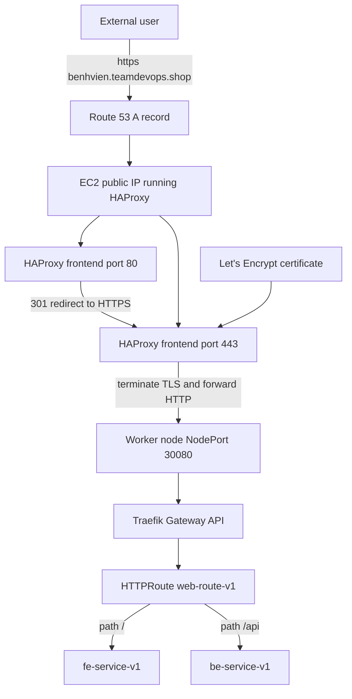

# ⚖️ HAProxy Edge Load Balancer


This directory contains the public HAProxy edge load balancer running on an EC2 instance. HAProxy is responsible for receiving public traffic from Route 53, terminating HTTPS with a Let's Encrypt certificate, and forwarding plain HTTP traffic into the Kubernetes cluster through Traefik NodePort `30080`.

---

## 🏗 Traffic Flow Architecture



---

## ✅ Design Decision

HTTPS is terminated only at HAProxy.

This means:

- Route 53 points `benhvien.teamdevops.shop` to the public IP of the EC2 instance running HAProxy.
- HAProxy listens on ports `80` and `443`.
- Port `80` redirects HTTP traffic to HTTPS.
- Port `443` uses a Let's Encrypt PEM certificate and terminates TLS.
- After TLS termination, HAProxy forwards HTTP traffic to Traefik NodePort `30080`.
- Traefik must not redirect HTTP to HTTPS because that would create a redirect loop.

Correct flow:

```text
Route53 -> EC2 HAProxy HTTPS -> HTTP to Traefik NodePort 30080 -> Gateway API -> FE or BE service
```

---

## 🔐 Let's Encrypt Certificate Setup

Run these commands on the EC2 instance that runs HAProxy.

### 1. Point DNS to HAProxy EC2

Create a Route 53 `A` record:

```text
benhvien.teamdevops.shop -> <HAProxy_EC2_PUBLIC_IP>
```

The EC2 security group must allow inbound traffic:

```text
TCP 80  from 0.0.0.0/0
TCP 443 from 0.0.0.0/0
```

### 2. Stop HAProxy before requesting the certificate

Certbot standalone needs port `80`, so stop the HAProxy container first:

```bash
cd ~/cicd-ecr-kube-ec2-gitaction/k8s-traefik-lb-demo/alb
sudo docker-compose stop haproxy
```

### 3. Install Certbot

Ubuntu:

```bash
sudo apt update
sudo apt install -y certbot
```

### 4. Request the Let's Encrypt certificate

```bash
sudo certbot certonly --standalone -d benhvien.teamdevops.shop
```

Certbot creates these files:

```text
/etc/letsencrypt/live/benhvien.teamdevops.shop/fullchain.pem
/etc/letsencrypt/live/benhvien.teamdevops.shop/privkey.pem
```

### 5. Create the HAProxy PEM file

HAProxy requires the certificate chain and private key to be merged into a single `.pem` file. It cannot load them from separate files.

```bash
cd ~/cicd-ecr-kube-ec2-gitaction/k8s-traefik-lb-demo/alb
sudo mkdir -p certs
sudo cat /etc/letsencrypt/live/benhvien.teamdevops.shop/fullchain.pem \
         /etc/letsencrypt/live/benhvien.teamdevops.shop/privkey.pem \
  | sudo tee ./certs/benhvien.teamdevops.shop.pem > /dev/null
sudo chmod 644 ./certs/benhvien.teamdevops.shop.pem
```

> **Why this step?** Let's Encrypt provides separate files, but HAProxy's `ssl crt` directive expects the full cryptographic bundle (Cert + Chain + Key) in one file.

The Docker Compose file mounts the certificate directory into HAProxy:

```yaml
volumes:
  - ./haproxy.cfg:/usr/local/etc/haproxy/haproxy.cfg:ro
  - ./certs:/usr/local/etc/haproxy/certs:ro
```

HAProxy uses the mounted certificate here:

```haproxy
bind *:443 ssl crt /usr/local/etc/haproxy/certs/benhvien.teamdevops.shop.pem
```

---

## ⚙️ Configuration Setup

1. Copy the environment variables:

```bash
cp .env.example .env
```

2. Update `.env`:

```env
ALB_DOMAIN="benhvien.teamdevops.shop"
KUBE_NODE_ADDRESS_TYPE="InternalIP"
TRAEFIK_HTTP_NODEPORT=30080
```

3. Ensure `kubectl` is authenticated on the HAProxy EC2 instance because `discover-traefik-nodes.sh` queries Kubernetes nodes and Traefik pods.

---

## 🚀 Running HAProxy

Generate the HAProxy config from the template and start the container.

**Note:** Always use `--force-recreate` when certificate files or volume mounts change to ensure Docker properly attaches the new `certs/` directory and loads the latest `haproxy.cfg`.

```bash
cd ~/cicd-ecr-kube-ec2-gitaction/k8s-traefik-lb-demo/alb

# 1. Discover worker nodes and generate haproxy.cfg
# Run as normal user (no sudo) to ensure kubectl uses your ~/.kube/config
bash discover-traefik-nodes.sh

# 2. Start/Restart HAProxy
sudo docker-compose up -d --force-recreate
```

If your host supports Docker Compose v2, this also works:

```bash
sudo docker compose up -d --force-recreate
```

---

## 🔄 Reload HAProxy After Worker Scale-Out

If Kubernetes worker nodes change (e.g., adding a new node to the cluster), HAProxy needs to be updated to forward traffic to the new node.

Our script automates this process:

```bash
cd ~/cicd-ecr-kube-ec2-gitaction/k8s-traefik-lb-demo/alb
bash reload-haproxy.sh
```

The reload flow:

1. Discover nodes with running Traefik pods using `kubectl`.
2. Generate a new `haproxy.cfg` from `haproxy.cfg.tpl` with the new IPs.
3. Validate the HAProxy config.
4. Gracefully reload the running container without dropping connections.

*(Note: `reload-haproxy.sh` handles the re-configuration automatically, meaning you don't need to manually recreate the PEM file or use `--force-recreate` just for adding a node, as the volume mounts remain unchanged).*

---

## 🧪 Verification

Check HTTP redirects to HTTPS:

```bash
curl -I http://benhvien.teamdevops.shop
```

Expected result:

```text
HTTP/1.1 301 Moved Permanently
Location: https://benhvien.teamdevops.shop/
```

Check HTTPS and certificate:

```bash
curl -IL --max-redirs 5 https://benhvien.teamdevops.shop
```

Expected result:

```text
HTTP/2 200
```

or the real application status code, but it must not loop with repeated `301` or `308` responses.

Check HAProxy logs:

```bash
sudo docker-compose logs -f haproxy
```

---

## ⚠️ Avoid Redirect Loops

Do not enable HTTP to HTTPS redirect inside Traefik when HAProxy is already terminating HTTPS.

Bad flow:

```text
User HTTPS -> HAProxy terminates TLS -> HTTP to Traefik -> Traefik redirects HTTPS -> loop
```

Correct rule:

```text
Only HAProxy redirects HTTP to HTTPS. Traefik only receives HTTP and routes to services.
```
