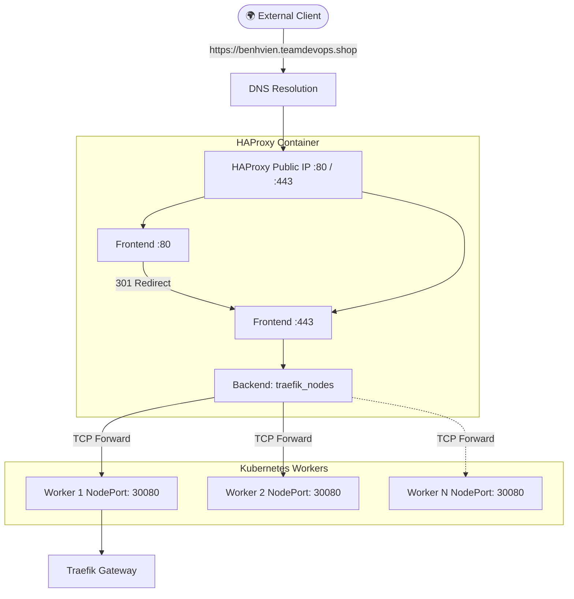

# ⚖️ HAProxy Edge Load Balancer


This directory contains a standalone HAProxy setup that acts as the external public load balancer in front of the private Kubernetes worker nodes.

---

## 🏗 Traffic Flow Architecture



---

## 🔄 Zero-Downtime Scale-Out Discovery

Because Kubernetes scales workers dynamically using Terraform, HAProxy needs to update its backend servers **without dropping active connections**.

We use `reload-haproxy.sh` coupled with `discover-traefik-nodes.sh` to achieve this:

1. **Discover**: Queries Kubernetes (`kubectl`) to find all worker nodes currently running a healthy Traefik Pod.
2. **Template**: Rewrites `haproxy.cfg` using `haproxy.cfg.tpl`.
3. **Validate**: Runs `haproxy -c` against the new config to prevent syntax errors from bringing down the LB.
4. **Graceful Reload**: Sends a `SIGUSR2` signal to the HAProxy container. The master process spins up a new worker with the updated backends, while the old worker drains existing connections.

### Why `externalTrafficPolicy: Local`?
Traefik is deployed as a DaemonSet, and its service uses `externalTrafficPolicy: Local`. This means HAProxy must only route traffic to worker nodes that *actually have* a Traefik pod running locally. The discovery script enforces this rule.

---

## ⚙️ Configuration Setup

1. Copy the environment variables:
```bash
cp .env.example .env
```

2. Update `.env` with your domain and Kubernetes API address type (InternalIP vs ExternalIP):
```env
ALB_DOMAIN="benhvien.teamdevops.shop"
KUBE_NODE_ADDRESS_TYPE="InternalIP"
```

3. Ensure `kubectl` is authenticated on the machine running HAProxy (so the discovery script can fetch nodes).

---

## 🚀 Running HAProxy

Start the load balancer:
```bash
bash discover-traefik-nodes.sh
docker compose up -d
```

### Manual Reload
If you manually add a node and want HAProxy to detect it immediately:
```bash
bash reload-haproxy.sh
```

### View Logs
```bash
docker logs -f haproxy-alb
