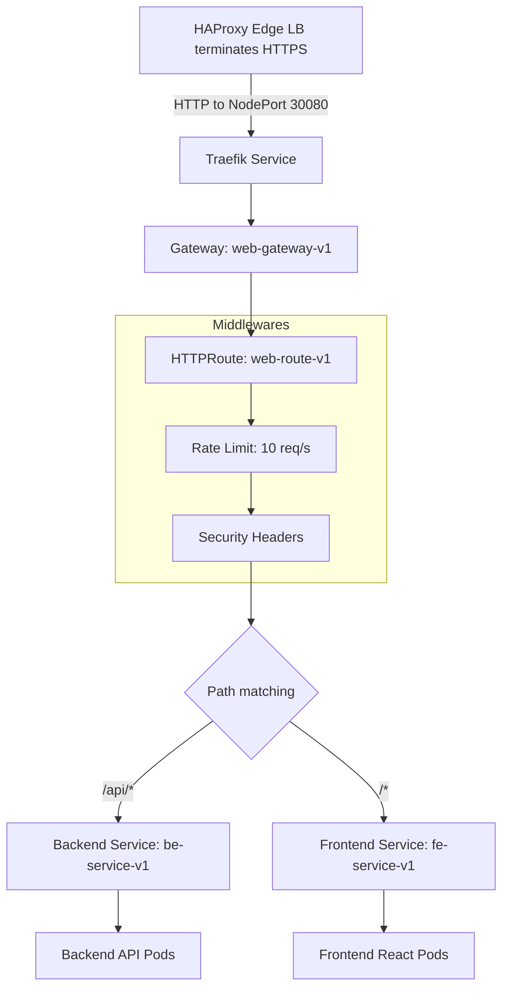

# 🚦 Kubernetes Traefik Gateway Stack


This directory contains the Kubernetes manifests to deploy Traefik as a **Gateway API** controller alongside the hospital application workloads (Frontend and Backend).

---

## 🏗 Traffic Flow Architecture



---

## ✅ Design Decision

HTTPS is terminated at the HAProxy edge load balancer, not at Traefik.

This means:

- Traefik only listens on HTTP port `8000` (exposed as NodePort `30080`).
- Traefik does not redirect HTTP to HTTPS.
- Traefik trusts forwarded headers from HAProxy using `--entrypoints.web.forwardedHeaders.insecure=true`.
- HAProxy sets `X-Forwarded-Proto: https`, `X-Forwarded-Port: 443`, and `X-Real-IP` so that backend services can detect the original protocol.

---

## 📂 Manifests Breakdown

| File | Purpose |
|---|---|
| `00-namespace.yaml` | Creates `traefik` and `hospital` namespaces. |
| `01-traefik-rbac.yaml` | ClusterRoles and bindings for Traefik to read Gateways and Services. |
| `02-traefik-gatewayclass.yaml` | Registers the Traefik `GatewayClass`. |
| `03-traefik-deployment.yaml` | Deploys Traefik as a DaemonSet. HTTP-only entrypoint on port `8000` with forwarded headers trusted. |
| `04-traefik-service.yaml` | Exposes Traefik via NodePort `30080` (HTTP only). |
| `05-fe-deployment.yaml` | Frontend Deployment — runs as non-root nginx UID 101, port 8000. |
| `06-fe-service.yaml` | Frontend ClusterIP Service — maps port 80 to container port 8000. |
| `07-be-deployment.yaml` | Backend Deployment — runs as non-root UID 1654, port 8080. |
| `08-be-service.yaml` | Backend ClusterIP Service — maps port 80 to container port 8080. |
| `09-gateway-routes.yaml` | Defines Gateway, Traefik Middlewares (rate limit, security headers, strip prefix), and HTTPRoute. |
| `10-network-policy.yaml` | Zero Trust NetworkPolicy: default deny ingress, allow Traefik to FE port 8000, allow Traefik to BE port 8080. |

---

## 🔒 ECR Authentication

The FE and BE Deployments pull private images from Amazon ECR using `imagePullSecrets`:

```yaml
imagePullSecrets:
  - name: ecr-registry-secret
```

Create the secret from the ECR login token:

```bash
aws ecr get-login-password --region us-east-1 \
  | kubectl create secret docker-registry ecr-registry-secret \
    -n hospital \
    --docker-server=<ACCOUNT_ID>.dkr.ecr.us-east-1.amazonaws.com \
    --docker-username=AWS \
    --docker-password-stdin
```

---

## 🚀 Deployment

The provided shell script checks for and installs required CRDs (Gateway API `v1.3.0` and Traefik v3 CRDs) before applying manifests:

```bash
cd k8s-traefik-lb-demo
bash k8s/apply.sh
```

In the full GitOps flow, ArgoCD handles manifest synchronization automatically.

### Verify Deployment

```bash
kubectl get pods -n hospital
kubectl get pods -n traefik
kubectl get gateway,httproute -n hospital
```

---

## ⚠️ Important: No HTTPS Redirect in Traefik

Since HAProxy terminates TLS and redirects HTTP to HTTPS at the edge, Traefik must not have any HTTP to HTTPS redirect configured.

The Traefik DaemonSet args should look like this:

```yaml
args:
  - --log.level=INFO
  - --api.dashboard=false
  - --ping=true
  - --providers.kubernetesgateway=true
  - --providers.kubernetescrd=true
  - --entrypoints.web.address=:8000
  - --entrypoints.web.forwardedHeaders.insecure=true
```

Do not add these args, otherwise HAProxy and Traefik will create a redirect loop:

```yaml
# DO NOT USE - causes redirect loop when HAProxy terminates TLS
- --entrypoints.web.http.redirections.entrypoint.to=websecure
- --entrypoints.web.http.redirections.entrypoint.scheme=https
- --entrypoints.websecure.address=:443
- --entrypoints.websecure.http.tls=true
```
