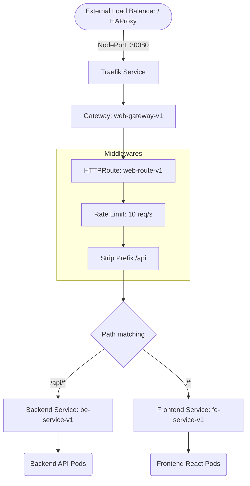

# 🚦 Kubernetes Traefik Gateway Stack


This directory contains the Kubernetes manifests to deploy Traefik as a **Gateway API** controller alongside the core hospital application workloads (Frontend and Backend).

---

## 🏗 Traffic Flow Architecture



---

## 📂 Manifests Breakdown

| File | Purpose |
|---|---|
| `00-namespace.yaml` | Creates `traefik` and `hospital` namespaces. |
| `01-traefik-rbac.yaml` | ClusterRoles/Bindings for Traefik to read Gateways & Services. |
| `02-traefik-gatewayclass.yaml` | Registers the Traefik `GatewayClass`. |
| `03-traefik-deployment.yaml` | Deploys Traefik as a DaemonSet; HTTP→HTTPS redirect and ACME TLS resolver enabled. |
| `04-traefik-service.yaml` | Exposes Traefik globally via NodePort `30080` (HTTP) and `30443` (HTTPS). |
| `05-fe-deployment.yaml` | Frontend Deployment — runs as **non-root** (`nginx` UID 101), `readOnlyRootFilesystem`, port **8000**. |
| `06-fe-service.yaml` | Frontend ClusterIP Service — maps port 80 → container port 8000. |
| `07-be-deployment.yaml` | Backend Deployment — runs as **non-root** (`app` UID 1654), `readOnlyRootFilesystem`, port 8080. |
| `08-be-service.yaml` | Backend ClusterIP Service — maps port 80 → container port 8080. |
| `09-gateway-routes.yaml` | Defines `Gateway`, Traefik `Middleware` (Rate Limits, Security Headers), and `HTTPRoute`. |
| `10-network-policy.yaml` | **Zero Trust NetworkPolicy** — default-deny-ingress + allow Traefik→FE (8000) + allow FE/Traefik→BE (8080). |

---

## 🔒 ECR Authentication

The Deployments (`05` and `07`) pull private images from Amazon ECR **without `imagePullSecrets`**.
Authentication is securely delegated to the **AWS IAM Instance Profiles** attached directly to the EC2 worker nodes by Terraform. 

---

## 🚀 Deployment / Setup

The provided shell script automatically checks for and installs required custom CRDs (Gateway API `v1.3.0` and Traefik v3 CRDs) before applying the local manifests.

```bash
cd k8s-traefik-lb-demo
bash k8s/apply.sh
```

*(Note: In the full GitOps flow, ArgoCD handles the synchronization of these manifests automatically.)*

### Verify Deployment:
```bash
kubectl get pods -n hospital
kubectl get gateway,httproute -n hospital
