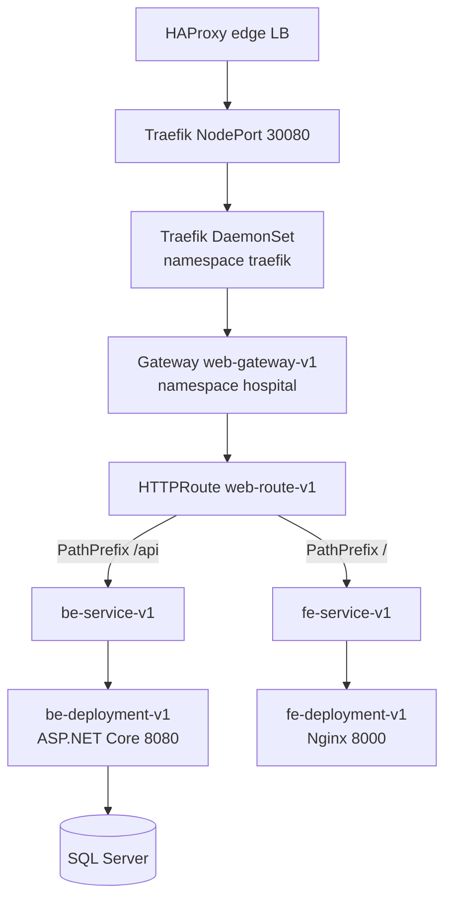

# Kubernetes Runtime Manifests


This folder defines the in-cluster runtime stack for the Hospital application. It deploys Traefik as the Gateway API implementation, runs the frontend and backend workloads, exposes them through services, and protects traffic with NetworkPolicies and Traefik middleware.

In normal production operation, Argo CD applies this folder from Git. The included `apply.sh` script is useful for first-time setup or manual recovery.

## Architecture



## Manifest Inventory

| File | Purpose |
|---|---|
| `00-namespace.yaml` | Creates `traefik` and `hospital` namespaces. |
| `01-traefik-rbac.yaml` | Creates Traefik ServiceAccount, ClusterRole, and binding. |
| `02-traefik-gatewayclass.yaml` | Defines GatewayClass `traefik`. |
| `03-traefik-deployment.yaml` | Runs Traefik as a DaemonSet. |
| `04-traefik-service.yaml` | Exposes Traefik on NodePort `30080`. |
| `05-fe-deployment.yaml` | Runs frontend pods from ECR image `ecr-fe:<sha>`. |
| `06-fe-service.yaml` | ClusterIP service for frontend pods. |
| `07-be-deployment.yaml` | Runs backend pods from ECR image `ecr-be:<sha>` and reads DB secret. |
| `08-be-service.yaml` | ClusterIP service for backend pods. |
| `09-gateway-routes.yaml` | Gateway, HTTPRoute, rate limit middleware, security headers middleware. |
| `10-network-policy.yaml` | Default-deny ingress plus allow rules from Traefik to application pods. |
| `apply.sh` | Installs required CRDs if missing and applies all manifests. |

## Required Secrets

### ECR Pull Secret

The frontend and backend deployments reference:

```yaml
imagePullSecrets:
  - name: ecr-registry-secret
```

Create or refresh it:

```bash
aws ecr get-login-password --region us-east-1 \
  | kubectl create secret docker-registry ecr-registry-secret \
    -n hospital \
    --docker-server=606030503959.dkr.ecr.us-east-1.amazonaws.com \
    --docker-username=AWS \
    --docker-password-stdin \
    --dry-run=client -o yaml | kubectl apply -f -
```

### Backend Database Secret

The backend reads `ConnectionStrings__DefaultConnection` from `be-db-secret`:

```bash
kubectl -n hospital create secret generic be-db-secret \
  --from-literal=default-connection='Server=<DB_HOST>,1433;Database=hospital;User Id=sa;Password=<DB_PASSWORD>;TrustServerCertificate=True;Encrypt=True' \
  --dry-run=client -o yaml | kubectl apply -f -
```

Restart backend pods after changing it:

```bash
kubectl -n hospital rollout restart deployment/be-deployment-v1
kubectl -n hospital rollout status deployment/be-deployment-v1
```

## Manual Apply

From the repository root:

```bash
cd k8s-traefik-lb-demo
bash k8s/apply.sh
```

The script installs these CRDs if missing:

| CRD group | Used for |
|---|---|
| Gateway API `v1.3.0` | `GatewayClass`, `Gateway`, `HTTPRoute`. |
| Traefik CRD | `Middleware`. |

## GitOps Apply

The recommended steady-state path is Argo CD:

```bash
kubectl apply -f argocd/hospital-traefik-app.yaml
```

Argo CD watches:

```text
repo: https://github.com/kien-devops/cicd-ecr-kube-ec2-gitaction.git
branch: devops
path: k8s-traefik-lb-demo/k8s
```

## Routing Rules

| Match | Backend service |
|---|---|
| `PathPrefix /api` | `be-service-v1` on service port `80`. |
| `PathPrefix /` | `fe-service-v1` on service port `80`. |

The API route is listed before the frontend route so `/api/*` does not fall through to the React application.

## Security Controls

| Control | Location |
|---|---|
| Non-root frontend container | `05-fe-deployment.yaml`. |
| Non-root backend container | `07-be-deployment.yaml`. |
| Read-only frontend root filesystem | `05-fe-deployment.yaml`. |
| Backend upload volume | `07-be-deployment.yaml`. |
| API rate limit middleware | `09-gateway-routes.yaml`. |
| Security headers middleware | `09-gateway-routes.yaml`. |
| Network default-deny | `10-network-policy.yaml`. |

## Verification

```bash
kubectl get pods -n traefik -o wide
kubectl get pods -n hospital -o wide
kubectl get svc -n traefik
kubectl get svc -n hospital
kubectl get gatewayclass
kubectl get gateway,httproute,middleware -n hospital
kubectl describe httproute web-route-v1 -n hospital
```

Test externally:

```bash
curl -I https://benhvien.teamdevops.shop
curl -i https://benhvien.teamdevops.shop/api/User/test
curl -i https://benhvien.teamdevops.shop/api/Branch
```

## Troubleshooting

| Symptom | Check |
|---|---|
| Gateway resources fail to apply | Gateway API and Traefik CRDs. |
| Pods show `ImagePullBackOff` | `ecr-registry-secret`, ECR tag, worker access to ECR. |
| Backend readiness fails | `/healthz`, DB secret, backend logs. |
| API returns frontend HTML | HTTPRoute rule order and `/api` path match. |
| HAProxy cannot reach Traefik | NodePort `30080`, worker security group, Traefik pod placement. |
| Traffic blocked inside cluster | `10-network-policy.yaml` allow rules and pod labels. |
