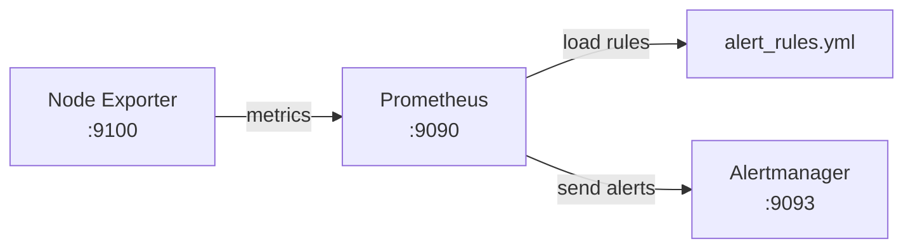

# Prometheus

Run Prometheus with the configuration from this folder.
The Node Exporter job uses EC2 service discovery and scrapes running instances tagged `Monitoring=enabled`.

Set the real Alertmanager target directly in `prometheus.yml` before starting Prometheus.

## Model



## Run With Docker

Create the Docker network if it does not already exist:

```bash
docker network create demo_network
```

Run Prometheus:

```bash
docker run -d \
  --name prometheus \
  --network demo_network \
  -p 9090:9090 \
  -v "<path-to-repo>/prometheus:/etc/prometheus:ro" \
  prom/prometheus:latest
```

Replace `<path-to-repo>` with the absolute path to this repository on the server.

Open Prometheus:

```text
http://<server-ip>:9090
```
