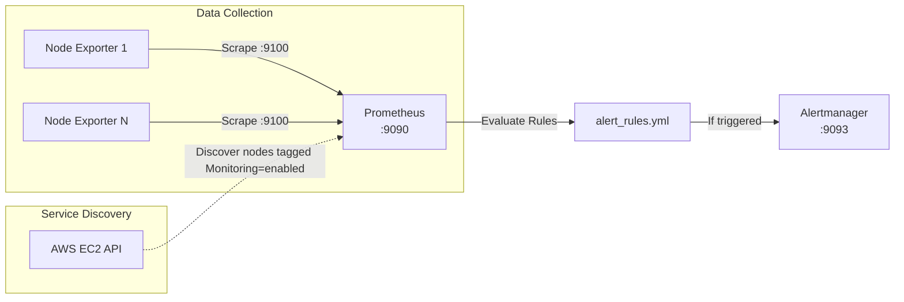

# 📊 Prometheus Monitoring Server


This directory contains the Prometheus server configuration and alert rules (`alert_rules.yml`) used to monitor the EC2 worker nodes. 

---

## 🏗 Architecture Model



---

## 📡 EC2 Service Discovery (`ec2_sd_configs`)

Prometheus does **not** use static target lists. Instead, it dynamically discovers nodes using the AWS EC2 API.
Nodes provisioned by Terraform automatically get the tag `Monitoring=enabled`. Prometheus queries AWS to find these nodes and scrapes their `node_exporter` metrics on port `9100`.

---

## 🚨 Alerting Rules (`alert_rules.yml`)

Prometheus evaluates auto-scaling rules and forwards alerts to Alertmanager:

1. **HighAverageNodeCpuUsage**: 
   - Condition: Cluster average CPU > 50% for 2 minutes.
   - Action payload: `action=scale-ec2`
2. **LowAverageNodeCpuUsage**: 
   - Condition: Cluster average CPU < 50% for 5 minutes.
   - Action payload: `action=scale-down-ec2`

---

## ⚙️ Setup and Configuration

Before starting Prometheus, ensure the Alertmanager target inside `prometheus.yml` points to the correct IP.

```yaml
alerting:
  alertmanagers:
  - static_configs:
    - targets:
      - "<ALERTMANAGER_IP>:9093"
```

---

## 🐳 Running Prometheus via Docker

Ensure AWS credentials with EC2 describe permissions are available (via environment or IAM instance profile), then run:

```bash
docker network create demo_network || true

docker run -d \
  --name prometheus \
  --network demo_network \
  -p 9090:9090 \
  -e AWS_REGION=us-east-1 \
  -v "$(pwd):/etc/prometheus:ro" \
  prom/prometheus:latest
```

Access UI: `http://<server-ip>:9090`
