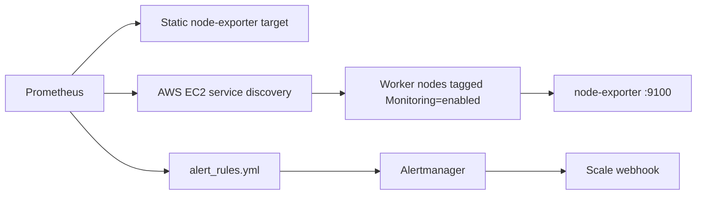
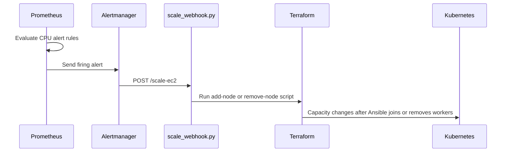

# Prometheus Monitoring


This folder contains Prometheus configuration for monitoring the EC2 worker layer and producing autoscaling signals for the Hospital platform.

Prometheus scrapes node-exporter metrics from a static monitoring host and from EC2 worker nodes discovered through AWS EC2 service discovery. Alert rules calculate average worker CPU usage and send scale-up or scale-down alerts to Alertmanager.

## Architecture



## Files

| File | Purpose |
|---|---|
| `prometheus.yml` | Scrape jobs, AWS EC2 service discovery, Alertmanager target. |
| `alert_rules.yml` | CPU-based scale-up and scale-down alert definitions. |

## Scrape Jobs

| Job | Target source | Purpose |
|---|---|---|
| `node-exporter-monitor-host` | Static target `54.163.216.25:9100` | Monitors the host running monitoring components. |
| `node-exporter-ec2-workers` | AWS EC2 service discovery | Monitors Kubernetes worker nodes. |

The EC2 discovery job depends on instance tags. Terraform applies tags such as `Monitoring=enabled` so Prometheus can find workers automatically.

## Alert Rules

| Alert | Condition | Duration | Action label |
|---|---|---|---|
| `HighAverageNodeCpuUsage` | Average worker CPU above 70 percent | 2 minutes | `scale-ec2` |
| `LowAverageNodeCpuUsage` | Average worker CPU below 30 percent | 5 minutes | `scale-down-ec2` |

The action label is consumed by `alertmanager/scale_webhook.py` to decide whether to scale up or down.

## Prerequisites

| Requirement | Notes |
|---|---|
| node-exporter | Must run on monitored hosts and expose port `9100`. |
| AWS credentials | Prometheus needs permission to describe EC2 instances. |
| Network access | Prometheus must reach worker private or public IPs on `9100`. |
| Alertmanager | Must be reachable by the address configured in `prometheus.yml`. |

## Run Prometheus with Docker

```bash
cd prometheus
docker network create demo_network || true

docker run -d \
  --name prometheus \
  --network demo_network \
  -p 9090:9090 \
  -e AWS_REGION=us-east-1 \
  -v "$(pwd):/etc/prometheus:ro" \
  prom/prometheus:latest
```

Open:

```text
http://<server-ip>:9090
```

## Recommended Validation

Check configuration syntax:

```bash
docker run --rm \
  -v "$(pwd):/etc/prometheus:ro" \
  prom/prometheus:latest \
  promtool check config /etc/prometheus/prometheus.yml
```

Check targets in the UI:

```text
Status -> Targets
```

Useful PromQL:

```promql
up{job="node-exporter-ec2-workers"}
ALERTS
100 - (avg by(instance) (rate(node_cpu_seconds_total{mode="idle"}[5m])) * 100)
```

## Integration with Autoscaling



## Troubleshooting

| Symptom | Check |
|---|---|
| EC2 worker targets missing | AWS credentials, region, EC2 tags, service discovery config. |
| Targets are DOWN | node-exporter process, security group port `9100`, route to worker IP. |
| Alerts never fire | Rule file loaded, PromQL expression, scrape interval, CPU load. |
| Alertmanager not receiving alerts | `alerting` section in `prometheus.yml`, Docker network, Alertmanager URL. |
| Scale action does not run | Alert labels, Alertmanager route, webhook logs and cooldown. |
