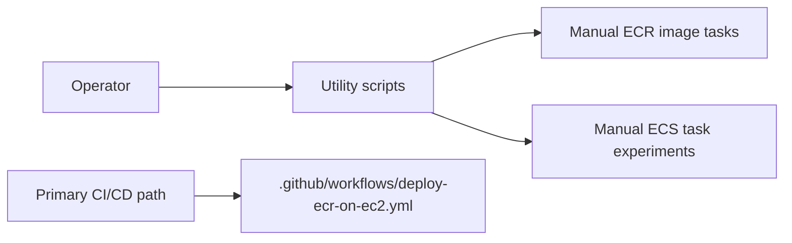

# Utility Scripts


This folder contains manual helper scripts for one-off operations. These scripts are not the primary deployment path; normal application delivery should use GitHub Actions, ECR, Argo CD, and the Kubernetes manifests.

## Scope



## Files

| File | Purpose |
|---|---|
| `push-be-ecr.ps1` | PowerShell helper for manually building and pushing the backend image to ECR. |
| `run-ecs-task.ps1` | PowerShell helper for manually running an ECS task. |

## Recommended Usage

Use these scripts only when you need to test or recover a specific manual operation. For routine deployments, prefer:

```text
.github/workflows/deploy-ecr-on-ec2.yml
```

The main workflow builds both frontend and backend images, pushes them to ECR, updates Kubernetes manifests, and lets Argo CD deploy the new version.

## Prerequisites

| Requirement | Notes |
|---|---|
| PowerShell | Scripts are written as `.ps1`. |
| Docker | Required for image build and tag operations. |
| AWS CLI | Required for ECR and ECS operations. |
| AWS credentials | Must allow the target ECR/ECS action. |

## Safety Notes

| Rule | Reason |
|---|---|
| Do not hardcode AWS credentials | Use AWS profiles, environment variables, or instance roles. |
| Do not hardcode application secrets | Keep secrets in GitHub Actions, Kubernetes Secrets, or local ignored files. |
| Prefer immutable image tags | Use Git SHAs or clear release tags instead of `latest`. |
| Validate target account and region | Manual scripts can affect the wrong AWS environment if credentials are misconfigured. |

## Verification

After pushing an image manually:

```bash
aws ecr describe-images \
  --repository-name ecr-be \
  --region us-east-1
```

After running ECS-related experiments:

```bash
aws ecs describe-tasks \
  --cluster <cluster-name> \
  --tasks <task-arn> \
  --region us-east-1
```

## Troubleshooting

| Symptom | Check |
|---|---|
| ECR login fails | AWS credentials, region, repository permissions. |
| Docker build fails | Dockerfile path and build context. |
| Image push denied | ECR repository name, IAM permissions, registry URL. |
| ECS task fails | Task definition, subnet/security group, image tag, execution role. |
