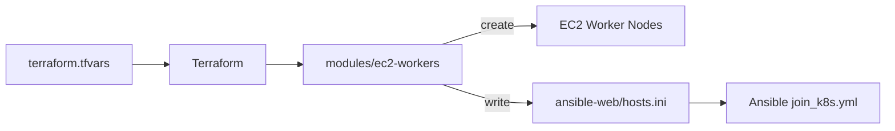

# Terraform

Use Terraform to create EC2 worker nodes and generate the Ansible inventory file.

## Directory Structure

```text
terraform/
  main.tf                         Root provider and module calls
  moved.tf                        State move hints for the module refactor
  variables.tf                    Root input variables
  outputs.tf                      Root outputs exposed from modules
  terraform.tfvars.example        Example local values
  modules/
    ec2-workers/
      main.tf                     EC2 worker and Ansible inventory resources
      variables.tf                Module input variables
      outputs.tf                  Module outputs
```

## Model



## Prepare Variables

Create the Terraform variables file:

```bash
cp terraform/terraform.tfvars.example terraform/terraform.tfvars
```

Edit `terraform/terraform.tfvars`:

```hcl
region            = "us-east-1"
project_name      = "hospital"
ami_id            = "ami-091138d0f0d41ff90"
instance_type     = "t3.small"
key_name          = "kien"
security_group_id = "sg-xxxxxxxxxxxxxxxxx"
vpc_id            = "vpc-xxxxxxxxxxxxxxxxx"

ansible_inventory_path = "/home/ubuntu/cicd-ecr-kube-ec2-gitaction/ansible-web/hosts.ini"

nodes = {
  node1 = {
    instance_type = "t3.small"
  }
}
```

## Run Terraform

```bash
cd terraform
terraform init
terraform fmt -recursive
terraform plan
terraform apply
```

The root includes `moved` blocks so existing state can move from the old root resources into `module.ec2_workers` without recreating the worker instances.

Show outputs:

```bash
terraform output
```

## Add One Node

Add the next node automatically:

```bash
bash terraform/add-node.sh
```

Add a node with a custom name and instance type:

```bash
bash terraform/add-node.sh node2 t3.small
```

The script updates `terraform.tfvars`, runs `terraform fmt`, `terraform init`, and `terraform apply -auto-approve`.

## Remove One Node

Remove the latest node automatically:

```bash
bash terraform/remove-node.sh
```

By default, the script keeps at least one Terraform node and only removes numbered `nodeN` entries from `terraform.tfvars`. Override the minimum when needed:

```bash
MIN_TERRAFORM_NODES=2 bash terraform/remove-node.sh
```

Remove a specific node:

```bash
bash terraform/remove-node.sh node2
```

The script updates `terraform.tfvars`, runs `terraform fmt`, `terraform init`, and `terraform apply -auto-approve`.

## Generated Inventory

Terraform writes the Ansible inventory to the path configured by:

```hcl
ansible_inventory_path = "/home/ubuntu/cicd-ecr-kube-ec2-gitaction/ansible-web/hosts.ini"
```

The generated inventory is used by Ansible:

```bash
ansible-playbook -i ansible-web/hosts.ini ansible-web/join_k8s.yml
```

## Modules

The root configuration calls `modules/ec2-workers` and passes the values from `terraform.tfvars`.

The `ec2-workers` module owns:

- EC2 worker instances.
- Common tags, including `Monitoring=enabled` for Prometheus EC2 service discovery.
- The generated Ansible inventory file.

Terraform does not create or attach IAM roles to worker EC2 instances. ECR access is handled outside this module: control/monitor servers can have roles attached manually, and Kubernetes pulls private images through `ecr-secret`.
