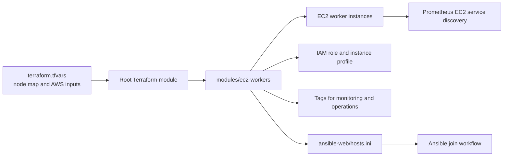

# Terraform AWS Worker Infrastructure


This folder manages EC2 worker nodes for the Kubernetes cluster. Terraform creates the worker instances, attaches IAM resources, applies discovery tags, and writes the Ansible inventory used by the node bootstrap workflow.

The Terraform layer is intentionally focused on worker lifecycle. Kubernetes installation and node joining are handled by `ansible-web/` after Terraform creates the EC2 instances.

## Architecture



## Folder Structure

| Path | Purpose |
|---|---|
| `main.tf` | Configures providers and calls the EC2 worker module. |
| `variables.tf` | Root module input variables. |
| `outputs.tf` | Public IPs, private IPs, instance IDs, and instance names. |
| `moved.tf` | Terraform state move declarations. |
| `terraform.tfvars.example` | Safe template for local infrastructure values. |
| `add-node.sh` | Adds one worker entry to `terraform.tfvars`, formats, initializes, and applies. |
| `remove-node.sh` | Removes one worker entry from `terraform.tfvars`, formats, initializes, and applies. |
| `modules/ec2-workers/` | Reusable module that creates EC2, IAM, tags, and inventory output. |

## Prerequisites

| Requirement | Notes |
|---|---|
| Terraform | Use Terraform 1.x. |
| AWS credentials | Environment credentials, profile, or EC2 instance role with EC2 and IAM permissions. |
| Existing VPC | `vpc_id` is passed in through `terraform.tfvars`. |
| Existing security group | Must allow SSH from the operator/build host and Kubernetes traffic required by your cluster. |
| Existing EC2 key pair | `key_name` must match an AWS key pair. |
| Ubuntu AMI | `ami_id` should point to the OS image expected by the Ansible playbook. |

## Configuration

Create a local variables file:

```bash
cd terraform
cp terraform.tfvars.example terraform.tfvars
```

Set values similar to:

```hcl
region                 = "us-east-1"
project_name           = "hospital"
ami_id                 = "ami-xxxxxxxxxxxxxxxxx"
instance_type          = "t3.medium"
key_name               = "your-keypair"
security_group_id      = "sg-xxxxxxxxxxxxxxxxx"
vpc_id                 = "vpc-xxxxxxxxxxxxxxxxx"
ansible_inventory_path = "../ansible-web/hosts.ini"

nodes = {
  node1 = {
    instance_type = "t3.medium"
  }
}
```

`terraform.tfvars` is intentionally ignored by Git because it contains environment-specific infrastructure values.

## Standard Workflow

Initialize and validate:

```bash
terraform init
terraform fmt -recursive
terraform validate
```

Review changes:

```bash
terraform plan
```

Apply:

```bash
terraform apply
```

Inspect outputs:

```bash
terraform output
terraform output -json private_ips
```

## Scale Out

Add the next numbered node automatically:

```bash
cd terraform
bash add-node.sh
```

Add a specific node name and instance type:

```bash
bash add-node.sh node3 t3.medium
```

The script:

1. Reads the current `nodes` map from `terraform.tfvars`.
2. Adds the next node block.
3. Runs `terraform fmt`.
4. Runs `terraform init`.
5. Runs `terraform apply -auto-approve`.

After this step, run the Ansible workflow so the new EC2 instance joins Kubernetes.

## Scale In

Remove the newest node automatically:

```bash
cd terraform
bash remove-node.sh
```

Remove a specific node:

```bash
bash remove-node.sh node3
```

Protect a minimum number of Terraform-managed nodes:

```bash
MIN_TERRAFORM_NODES=1 bash remove-node.sh
```

## Integration Points

| Consumer | How it uses Terraform output |
|---|---|
| `ansible-web/provision-ec2-and-run-ansible.sh` | Calls `add-node.sh`, reads private IP outputs, and joins the newest node to Kubernetes. |
| `ansible-web/hosts.ini` | Generated inventory file used by Ansible. |
| `prometheus/prometheus.yml` | Discovers EC2 workers tagged for monitoring. |
| `alertmanager/scale_webhook.py` | Runs scale scripts when CPU alerts fire. |
| `remove-worker-and-reload.sh` | Performs scale-in and reloads HAProxy after worker changes. |

## Verification

```bash
terraform state list
terraform output public_ips
terraform output private_ips
test -f ../ansible-web/hosts.ini && cat ../ansible-web/hosts.ini
```

In AWS, confirm the instances have the expected project tags and monitoring tag.

## Troubleshooting

| Symptom | Check |
|---|---|
| `terraform init` fails | Provider registry access and Terraform version. |
| EC2 creation fails | AMI ID, subnet/VPC defaults, security group, key pair, IAM permission. |
| Ansible inventory missing | `ansible_inventory_path` in `terraform.tfvars`. |
| Prometheus cannot discover workers | EC2 tags, AWS region, Prometheus IAM permission for `DescribeInstances`. |
| Scale-down removes the wrong node | Pass the node name explicitly, for example `bash remove-node.sh node2`. |
