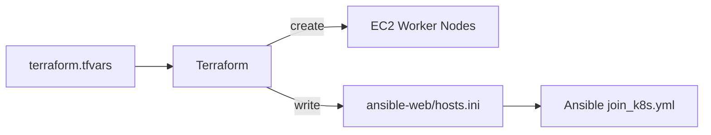

# Terraform

Use Terraform to create EC2 worker nodes and generate the Ansible inventory file.

## Model



## Prepare Variables

Create the Terraform variables file:

```bash
cp terraform/terraform.tfvars.example terraform/terraform.tfvars
```

Edit `terraform/terraform.tfvars`:

```hcl
region            = "ap-southeast-1"
ami_id            = "ami-xxxxxxxxxxxxxxxxx"
instance_type     = "t2.micro"
key_name          = "your-keypair-name"
security_group_id = "sg-xxxxxxxxxxxxxxxxx"
vpc_id            = "vpc-xxxxxxxxxxxxxxxxx"

ansible_inventory_path = "/home/ubuntu/ansible-web/hosts.ini"

nodes = {
  node1 = {
    instance_type = "t2.micro"
  }
}
```

## Run Terraform

```bash
cd terraform
terraform init
terraform fmt
terraform plan
terraform apply
```

Show outputs:

```bash
terraform output
```

## Add One Node

Add the next node automatically:

```bash
bash terraform/add-node.sh
```

Add a node with a custom name and instance type:

```bash
bash terraform/add-node.sh node2 t2.micro
```

The script updates `terraform.tfvars`, runs `terraform fmt`, `terraform init`, and `terraform apply -auto-approve`.

## Remove One Node

Remove the latest node automatically:

```bash
bash terraform/remove-node.sh
```

Remove a specific node:

```bash
bash terraform/remove-node.sh node2
```

The script updates `terraform.tfvars`, runs `terraform fmt`, `terraform init`, and `terraform apply -auto-approve`.

## Generated Inventory

Terraform writes the Ansible inventory to the path configured by:

```hcl
ansible_inventory_path = "/home/ubuntu/ansible-web/hosts.ini"
```

The generated inventory is used by Ansible:

```bash
ansible-playbook -i ansible-web/hosts.ini ansible-web/join_k8s.yml
```
